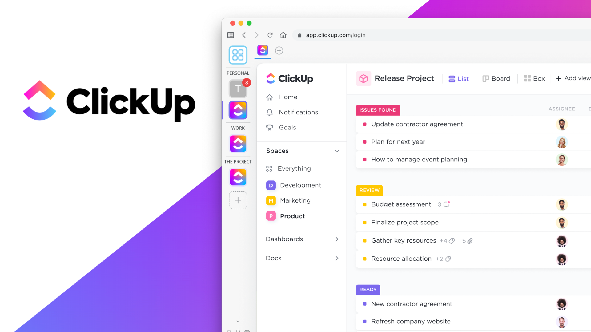

<div align="left">

[](https://clickup.com)

# Clickup<a id="clickup"></a>

This is the ClickUp API Reference where you can learn about specific endpoints and parameters in detail.

Browse the available endpoints using the sidebar on the left.

**Not sure where to begin?**
[Get Started with the ClickUp API](https://clickup.com/api)


</div>

## Table of Contents<a id="table-of-contents"></a>

<!-- toc -->

- [Requirements](#requirements)
- [Installation](#installation)
- [Getting Started](#getting-started)
- [Async](#async)
- [Raw HTTP Response](#raw-http-response)
- [Reference](#reference)
  * [`clickup.attachments.upload_file_to_task_as_attachment`](#clickupattachmentsupload_file_to_task_as_attachment)
  * [`clickup.authorization.get_access_token`](#clickupauthorizationget_access_token)
  * [`clickup.authorization.get_workspace_list`](#clickupauthorizationget_workspace_list)
  * [`clickup.authorization.view_account_details`](#clickupauthorizationview_account_details)
  * [`clickup.comments.add_to_list_comment`](#clickupcommentsadd_to_list_comment)
  * [`clickup.comments.create_chat_view_comment`](#clickupcommentscreate_chat_view_comment)
  * [`clickup.comments.create_new_task_comment`](#clickupcommentscreate_new_task_comment)
  * [`clickup.comments.delete_task_comment`](#clickupcommentsdelete_task_comment)
  * [`clickup.comments.get_list_comments`](#clickupcommentsget_list_comments)
  * [`clickup.comments.get_task_comments`](#clickupcommentsget_task_comments)
  * [`clickup.comments.get_view_comments`](#clickupcommentsget_view_comments)
  * [`clickup.comments.update_task_comment`](#clickupcommentsupdate_task_comment)
  * [`clickup.custom_fields.get_list_fields`](#clickupcustom_fieldsget_list_fields)
  * [`clickup.custom_fields.remove_field_value`](#clickupcustom_fieldsremove_field_value)
  * [`clickup.custom_fields.set_field_value`](#clickupcustom_fieldsset_field_value)
  * [`clickup.custom_task_types.get_available_task_types`](#clickupcustom_task_typesget_available_task_types)
  * [`clickup.folders.create_new_folder`](#clickupfolderscreate_new_folder)
  * [`clickup.folders.get_contents_of`](#clickupfoldersget_contents_of)
  * [`clickup.folders.get_folder_content`](#clickupfoldersget_folder_content)
  * [`clickup.folders.remove_folder`](#clickupfoldersremove_folder)
  * [`clickup.folders.rename_folder`](#clickupfoldersrename_folder)
  * [`clickup.goals.add_key_result`](#clickupgoalsadd_key_result)
  * [`clickup.goals.add_new_goal_to_workspace`](#clickupgoalsadd_new_goal_to_workspace)
  * [`clickup.goals.get_details`](#clickupgoalsget_details)
  * [`clickup.goals.get_workspace_goals`](#clickupgoalsget_workspace_goals)
  * [`clickup.goals.remove_goal`](#clickupgoalsremove_goal)
  * [`clickup.goals.remove_target`](#clickupgoalsremove_target)
  * [`clickup.goals.update_goal_details`](#clickupgoalsupdate_goal_details)
  * [`clickup.goals.update_key_result`](#clickupgoalsupdate_key_result)
  * [`clickup.guests.add_guest_to_folder`](#clickupguestsadd_guest_to_folder)
  * [`clickup.guests.add_to_task`](#clickupguestsadd_to_task)
  * [`clickup.guests.edit_guest_on_workspace`](#clickupguestsedit_guest_on_workspace)
  * [`clickup.guests.get_guest_information`](#clickupguestsget_guest_information)
  * [`clickup.guests.invite_to_workspace`](#clickupguestsinvite_to_workspace)
  * [`clickup.guests.remove_from_list`](#clickupguestsremove_from_list)
  * [`clickup.guests.revoke_access_from_folder`](#clickupguestsrevoke_access_from_folder)
  * [`clickup.guests.revoke_access_to_task`](#clickupguestsrevoke_access_to_task)
  * [`clickup.guests.revoke_guest_access_to_workspace`](#clickupguestsrevoke_guest_access_to_workspace)
  * [`clickup.guests.share_list_with`](#clickupguestsshare_list_with)
  * [`clickup.lists.add_task_to_list`](#clickuplistsadd_task_to_list)
  * [`clickup.lists.add_to_folder`](#clickuplistsadd_to_folder)
  * [`clickup.lists.create_folderless_list`](#clickuplistscreate_folderless_list)
  * [`clickup.lists.get_folder_lists`](#clickuplistsget_folder_lists)
  * [`clickup.lists.get_folderless`](#clickuplistsget_folderless)
  * [`clickup.lists.get_list_details`](#clickuplistsget_list_details)
  * [`clickup.lists.remove_list`](#clickuplistsremove_list)
  * [`clickup.lists.remove_task_from_list`](#clickuplistsremove_task_from_list)
  * [`clickup.lists.update_list_info_due_date_priority_assignee_color`](#clickuplistsupdate_list_info_due_date_priority_assignee_color)
  * [`clickup.members.get_list_users`](#clickupmembersget_list_users)
  * [`clickup.members.get_task_access`](#clickupmembersget_task_access)
  * [`clickup.roles.list_available_custom_roles`](#clickuproleslist_available_custom_roles)
  * [`clickup.shared_hierarchy.view_tasks_lists_folders`](#clickupshared_hierarchyview_tasks_lists_folders)
  * [`clickup.spaces.add_new_space_to_workspace`](#clickupspacesadd_new_space_to_workspace)
  * [`clickup.spaces.get_details`](#clickupspacesget_details)
  * [`clickup.spaces.get_space_details`](#clickupspacesget_space_details)
  * [`clickup.spaces.remove_space`](#clickupspacesremove_space)
  * [`clickup.spaces.update_details_and_enable_click_apps`](#clickupspacesupdate_details_and_enable_click_apps)
  * [`clickup.tags.add_to_task`](#clickuptagsadd_to_task)
  * [`clickup.tags.create_space_tag`](#clickuptagscreate_space_tag)
  * [`clickup.tags.get_space`](#clickuptagsget_space)
  * [`clickup.tags.remove_from_task`](#clickuptagsremove_from_task)
  * [`clickup.tags.remove_space_tag`](#clickuptagsremove_space_tag)
  * [`clickup.tags.update_space_tag`](#clickuptagsupdate_space_tag)
  * [`clickup.task_checklists.add_line_item`](#clickuptask_checklistsadd_line_item)
  * [`clickup.task_checklists.create_new_checklist`](#clickuptask_checklistscreate_new_checklist)
  * [`clickup.task_checklists.remove_checklist`](#clickuptask_checklistsremove_checklist)
  * [`clickup.task_checklists.remove_checklist_item`](#clickuptask_checklistsremove_checklist_item)
  * [`clickup.task_checklists.update_checklist`](#clickuptask_checklistsupdate_checklist)
  * [`clickup.task_checklists.update_checklist_item`](#clickuptask_checklistsupdate_checklist_item)
  * [`clickup.task_relationships.add_dependency`](#clickuptask_relationshipsadd_dependency)
  * [`clickup.task_relationships.link_tasks`](#clickuptask_relationshipslink_tasks)
  * [`clickup.task_relationships.remove_dependency`](#clickuptask_relationshipsremove_dependency)
  * [`clickup.task_relationships.remove_link_between_tasks`](#clickuptask_relationshipsremove_link_between_tasks)
  * [`clickup.task_templates.create_from_template`](#clickuptask_templatescreate_from_template)
  * [`clickup.task_templates.get_templates`](#clickuptask_templatesget_templates)
  * [`clickup.tasks.create_new_task`](#clickuptaskscreate_new_task)
  * [`clickup.tasks.filter_team_tasks`](#clickuptasksfilter_team_tasks)
  * [`clickup.tasks.get_list_tasks`](#clickuptasksget_list_tasks)
  * [`clickup.tasks.get_task_details`](#clickuptasksget_task_details)
  * [`clickup.tasks.get_time_in_status`](#clickuptasksget_time_in_status)
  * [`clickup.tasks.get_time_in_status_bulk`](#clickuptasksget_time_in_status_bulk)
  * [`clickup.tasks.remove_task_by_id`](#clickuptasksremove_task_by_id)
  * [`clickup.tasks.update_task_fields`](#clickuptasksupdate_task_fields)
  * [`clickup.teams___user_groups.create_team`](#clickupteams___user_groupscreate_team)
  * [`clickup.teams___user_groups.get_user_groups`](#clickupteams___user_groupsget_user_groups)
  * [`clickup.teams___user_groups.remove_group`](#clickupteams___user_groupsremove_group)
  * [`clickup.teams___user_groups.update_user_group`](#clickupteams___user_groupsupdate_user_group)
  * [`clickup.teams___workspaces.get_workspace_list`](#clickupteams___workspacesget_workspace_list)
  * [`clickup.teams___workspaces.get_workspace_plan`](#clickupteams___workspacesget_workspace_plan)
  * [`clickup.teams___workspaces.get_workspace_seats`](#clickupteams___workspacesget_workspace_seats)
  * [`clickup.time_tracking.add_tags_from_time_entries`](#clickuptime_trackingadd_tags_from_time_entries)
  * [`clickup.time_tracking.change_tag_names`](#clickuptime_trackingchange_tag_names)
  * [`clickup.time_tracking.create_time_entry`](#clickuptime_trackingcreate_time_entry)
  * [`clickup.time_tracking.get_all_tags_from_time_entries`](#clickuptime_trackingget_all_tags_from_time_entries)
  * [`clickup.time_tracking.get_current_time_entry`](#clickuptime_trackingget_current_time_entry)
  * [`clickup.time_tracking.get_single_time_entry`](#clickuptime_trackingget_single_time_entry)
  * [`clickup.time_tracking.get_time_entries_within_date_range`](#clickuptime_trackingget_time_entries_within_date_range)
  * [`clickup.time_tracking.get_time_entry_history`](#clickuptime_trackingget_time_entry_history)
  * [`clickup.time_tracking.remove_entry`](#clickuptime_trackingremove_entry)
  * [`clickup.time_tracking.remove_tags_from_time_entries`](#clickuptime_trackingremove_tags_from_time_entries)
  * [`clickup.time_tracking.start_timer`](#clickuptime_trackingstart_timer)
  * [`clickup.time_tracking.stop_time_entry`](#clickuptime_trackingstop_time_entry)
  * [`clickup.time_tracking.update_time_entry_details`](#clickuptime_trackingupdate_time_entry_details)
  * [`clickup.time_tracking_(legacy).edit_time_tracked`](#clickuptime_tracking_legacyedit_time_tracked)
  * [`clickup.time_tracking_(legacy).get_tracked_time`](#clickuptime_tracking_legacyget_tracked_time)
  * [`clickup.time_tracking_(legacy).record_time_for_task`](#clickuptime_tracking_legacyrecord_time_for_task)
  * [`clickup.time_tracking_(legacy).remove_tracked_time`](#clickuptime_tracking_legacyremove_tracked_time)
  * [`clickup.users.deactivate_from_workspace`](#clickupusersdeactivate_from_workspace)
  * [`clickup.users.get_user_details`](#clickupusersget_user_details)
  * [`clickup.users.invite_user_to_workspace`](#clickupusersinvite_user_to_workspace)
  * [`clickup.users.update_user_details`](#clickupusersupdate_user_details)
  * [`clickup.views.add_view_to_folder`](#clickupviewsadd_view_to_folder)
  * [`clickup.views.add_view_to_list`](#clickupviewsadd_view_to_list)
  * [`clickup.views.add_view_to_space`](#clickupviewsadd_view_to_space)
  * [`clickup.views.create_workspace_view_everything_level`](#clickupviewscreate_workspace_view_everything_level)
  * [`clickup.views.delete_view_by_id`](#clickupviewsdelete_view_by_id)
  * [`clickup.views.folder_views_get`](#clickupviewsfolder_views_get)
  * [`clickup.views.get_everything_level`](#clickupviewsget_everything_level)
  * [`clickup.views.get_list_views`](#clickupviewsget_list_views)
  * [`clickup.views.get_tasks_in_view`](#clickupviewsget_tasks_in_view)
  * [`clickup.views.get_view_info`](#clickupviewsget_view_info)
  * [`clickup.views.space_views_get`](#clickupviewsspace_views_get)
  * [`clickup.views.update_view_details`](#clickupviewsupdate_view_details)
  * [`clickup.webhooks.create_webhook`](#clickupwebhookscreate_webhook)
  * [`clickup.webhooks.remove_webhook_by_id`](#clickupwebhooksremove_webhook_by_id)
  * [`clickup.webhooks.update_events_to_monitor`](#clickupwebhooksupdate_events_to_monitor)
  * [`clickup.webhooks.workspace_get`](#clickupwebhooksworkspace_get)

<!-- tocstop -->

## Requirements<a id="requirements"></a>

Python >=3.7

## Installation<a id="installation"></a>
<div align="center">
  <a href="https://konfigthis.com/sdk-sign-up?company=ClickUp&language=Python">
    
  </a>
</div>

## Getting Started<a id="getting-started"></a>

```python
from pprint import pprint
from click_up_python_sdk import ClickUp, ApiException

clickup = ClickUp(

        authorization_token = 'YOUR_API_KEY',
)

try:
    # Create Task Attachment
    upload_file_to_task_as_attachment_response = clickup.attachments.upload_file_to_task_as_attachment(
        body=None,
        task_id="9hv",
        custom_task_ids=True,
        team_id=123,
        attachment=[
        None
    ],
    )
    print(upload_file_to_task_as_attachment_response)
except ApiException as e:
    print("Exception when calling AttachmentsApi.upload_file_to_task_as_attachment: %s\n" % e)
    pprint(e.body)
    pprint(e.headers)
    pprint(e.status)
    pprint(e.reason)
    pprint(e.round_trip_time)
```

## Async<a id="async"></a>

`async` support is available by prepending `a` to any method.

```python

import asyncio
from pprint import pprint
from click_up_python_sdk import ClickUp, ApiException

clickup = ClickUp(

        authorization_token = 'YOUR_API_KEY',
)

async def main():
    try:
        # Create Task Attachment
        upload_file_to_task_as_attachment_response = await clickup.attachments.aupload_file_to_task_as_attachment(
            body=None,
            task_id="9hv",
            custom_task_ids=True,
            team_id=123,
            attachment=[
        None
    ],
        )
        print(upload_file_to_task_as_attachment_response)
    except ApiException as e:
        print("Exception when calling AttachmentsApi.upload_file_to_task_as_attachment: %s\n" % e)
        pprint(e.body)
        pprint(e.headers)
        pprint(e.status)
        pprint(e.reason)
        pprint(e.round_trip_time)

asyncio.run(main())
```

## Raw HTTP Response<a id="raw-http-response"></a>

To access raw HTTP response values, use the `.raw` namespace.

```python
from pprint import pprint
from click_up_python_sdk import ClickUp, ApiException

clickup = ClickUp(

        authorization_token = 'YOUR_API_KEY',
)

try:
    # Create Task Attachment
    upload_file_to_task_as_attachment_response = clickup.attachments.raw.upload_file_to_task_as_attachment(
        body=None,
        task_id="9hv",
        custom_task_ids=True,
        team_id=123,
        attachment=[
        None
    ],
    )
    pprint(upload_file_to_task_as_attachment_response.body)
    pprint(upload_file_to_task_as_attachment_response.body["title"])
    pprint(upload_file_to_task_as_attachment_response.body["version"])
    pprint(upload_file_to_task_as_attachment_response.body["id"])
    pprint(upload_file_to_task_as_attachment_response.body["date"])
    pprint(upload_file_to_task_as_attachment_response.body["extension"])
    pprint(upload_file_to_task_as_attachment_response.body["thumbnail_small"])
    pprint(upload_file_to_task_as_attachment_response.body["thumbnail_large"])
    pprint(upload_file_to_task_as_attachment_response.body["url"])
    pprint(upload_file_to_task_as_attachment_response.headers)
    pprint(upload_file_to_task_as_attachment_response.status)
    pprint(upload_file_to_task_as_attachment_response.round_trip_time)
except ApiException as e:
    print("Exception when calling AttachmentsApi.upload_file_to_task_as_attachment: %s\n" % e)
    pprint(e.body)
    pprint(e.headers)
    pprint(e.status)
    pprint(e.reason)
    pprint(e.round_trip_time)
```


## Reference<a id="reference"></a>
### `clickup.attachments.upload_file_to_task_as_attachment`<a id="clickupattachmentsupload_file_to_task_as_attachment"></a>

Upload a file to a task as an attachment. \
 \
***Note:** This request uses multipart/form-data as the content type.*

#### 🛠️ Usage<a id="🛠️-usage"></a>

```python
upload_file_to_task_as_attachment_response = clickup.attachments.upload_file_to_task_as_attachment(
    body=None,
    task_id="9hv",
    custom_task_ids=True,
    team_id=123,
    attachment=[
        None
    ],
)
```

#### ⚙️ Parameters<a id="⚙️-parameters"></a>

##### task_id: `str`<a id="task_id-str"></a>

##### custom_task_ids: `bool`<a id="custom_task_ids-bool"></a>

If you want to reference a task by it's custom task id, this value must be `true`.

##### team_id: `Union[int, float]`<a id="team_id-unionint-float"></a>

Only used when the `custom_task_ids` parameter is set to `true`.\\  \\ For example: `custom_task_ids=true&team_id=123`.

##### attachment: List[[`Union[bool, date, datetime, dict, float, int, list, str, None]`](./click_up_python_sdk/type/typing_union_bool_date_datetime_dict_float_int_list_str_none.py)]<a id="attachment-listunionbool-date-datetime-dict-float-int-list-str-noneclick_up_python_sdktypetyping_union_bool_date_datetime_dict_float_int_list_str_nonepy"></a>

#### ⚙️ Request Body<a id="⚙️-request-body"></a>

[`AttachmentsUploadFileToTaskAsAttachmentRequest`](./click_up_python_sdk/type/attachments_upload_file_to_task_as_attachment_request.py)
#### 🔄 Return<a id="🔄-return"></a>

[`CreateTaskAttachmentresponse`](./click_up_python_sdk/pydantic/create_task_attachmentresponse.py)

#### 🌐 Endpoint<a id="🌐-endpoint"></a>

`/task/{task_id}/attachment` `post`

[🔙 **Back to Table of Contents**](#table-of-contents)

---

### `clickup.authorization.get_access_token`<a id="clickupauthorizationget_access_token"></a>

These are the routes for authing the API and going through the [OAuth flow](https://clickup.com/api).\
 \
Applications utilizing a personal API token don't use this endpoint.\
 \
***Note:** OAuth tokens are not supported when using the [**Try It** feature](https://clickup.com/api) of our Reference docs. You can't try this endpoint from your web browser.*


#### 🛠️ Usage<a id="🛠️-usage"></a>

```python
get_access_token_response = clickup.authorization.get_access_token(
    client_id="client_id_example",
    client_secret="client_secret_example",
    code="code_example",
)
```

#### ⚙️ Parameters<a id="⚙️-parameters"></a>

##### client_id: `str`<a id="client_id-str"></a>

Oauth app client id

##### client_secret: `str`<a id="client_secret-str"></a>

Oauth app client secret

##### code: `str`<a id="code-str"></a>

Code given in redirect url

#### 🔄 Return<a id="🔄-return"></a>

[`GetAccessTokenresponse`](./click_up_python_sdk/pydantic/get_access_tokenresponse.py)

#### 🌐 Endpoint<a id="🌐-endpoint"></a>

`/oauth/token` `post`

[🔙 **Back to Table of Contents**](#table-of-contents)

---

### `clickup.authorization.get_workspace_list`<a id="clickupauthorizationget_workspace_list"></a>

View the Workspaces available to the authenticated user.

#### 🛠️ Usage<a id="🛠️-usage"></a>

```python
get_workspace_list_response = clickup.authorization.get_workspace_list()
```

#### 🔄 Return<a id="🔄-return"></a>

[`GetAuthorizedTeamsresponse`](./click_up_python_sdk/pydantic/get_authorized_teamsresponse.py)

#### 🌐 Endpoint<a id="🌐-endpoint"></a>

`/team` `get`

[🔙 **Back to Table of Contents**](#table-of-contents)

---

### `clickup.authorization.view_account_details`<a id="clickupauthorizationview_account_details"></a>

View the details of the authenticated user's ClickUp account.

#### 🛠️ Usage<a id="🛠️-usage"></a>

```python
view_account_details_response = clickup.authorization.view_account_details()
```

#### 🔄 Return<a id="🔄-return"></a>

[`GetAuthorizedUserresponse`](./click_up_python_sdk/pydantic/get_authorized_userresponse.py)

#### 🌐 Endpoint<a id="🌐-endpoint"></a>

`/user` `get`

[🔙 **Back to Table of Contents**](#table-of-contents)

---

### `clickup.comments.add_to_list_comment`<a id="clickupcommentsadd_to_list_comment"></a>

Add a comment to a List.

#### 🛠️ Usage<a id="🛠️-usage"></a>

```python
add_to_list_comment_response = clickup.comments.add_to_list_comment(
    comment_text="List comment content",
    assignee=183,
    notify_all=True,
    list_id=124,
)
```

#### ⚙️ Parameters<a id="⚙️-parameters"></a>

##### comment_text: `str`<a id="comment_text-str"></a>

##### assignee: `int`<a id="assignee-int"></a>

##### notify_all: `bool`<a id="notify_all-bool"></a>

If `notify_all` is true, notifications will be sent to everyone including the creator of the comment.

##### list_id: `Union[int, float]`<a id="list_id-unionint-float"></a>

#### ⚙️ Request Body<a id="⚙️-request-body"></a>

[`CreateListCommentrequest`](./click_up_python_sdk/type/create_list_commentrequest.py)
#### 🔄 Return<a id="🔄-return"></a>

[`CreateListCommentresponse`](./click_up_python_sdk/pydantic/create_list_commentresponse.py)

#### 🌐 Endpoint<a id="🌐-endpoint"></a>

`/list/{list_id}/comment` `post`

[🔙 **Back to Table of Contents**](#table-of-contents)

---

### `clickup.comments.create_chat_view_comment`<a id="clickupcommentscreate_chat_view_comment"></a>

Add a new comment to a Chat view.

#### 🛠️ Usage<a id="🛠️-usage"></a>

```python
create_chat_view_comment_response = clickup.comments.create_chat_view_comment(
    comment_text="View comment content",
    notify_all=True,
    view_id="3c",
)
```

#### ⚙️ Parameters<a id="⚙️-parameters"></a>

##### comment_text: `str`<a id="comment_text-str"></a>

##### notify_all: `bool`<a id="notify_all-bool"></a>

If `notify_all` is true, notifications will be sent to everyone including the creator of the comment.

##### view_id: `str`<a id="view_id-str"></a>

105 (string)

#### ⚙️ Request Body<a id="⚙️-request-body"></a>

[`CreateChatViewCommentrequest`](./click_up_python_sdk/type/create_chat_view_commentrequest.py)
#### 🔄 Return<a id="🔄-return"></a>

[`CreateChatViewCommentresponse`](./click_up_python_sdk/pydantic/create_chat_view_commentresponse.py)

#### 🌐 Endpoint<a id="🌐-endpoint"></a>

`/view/{view_id}/comment` `post`

[🔙 **Back to Table of Contents**](#table-of-contents)

---

### `clickup.comments.create_new_task_comment`<a id="clickupcommentscreate_new_task_comment"></a>

Add a new comment to a task.

#### 🛠️ Usage<a id="🛠️-usage"></a>

```python
create_new_task_comment_response = clickup.comments.create_new_task_comment(
    comment_text="Task comment content",
    assignee=183,
    notify_all=True,
    task_id="9hz",
    custom_task_ids=True,
    team_id=123,
)
```

#### ⚙️ Parameters<a id="⚙️-parameters"></a>

##### comment_text: `str`<a id="comment_text-str"></a>

##### assignee: `int`<a id="assignee-int"></a>

##### notify_all: `bool`<a id="notify_all-bool"></a>

If `notify_all` is true, notifications will be sent to everyone including the creator of the comment.

##### task_id: `str`<a id="task_id-str"></a>

##### custom_task_ids: `bool`<a id="custom_task_ids-bool"></a>

If you want to reference a task by it's custom task id, this value must be `true`.

##### team_id: `Union[int, float]`<a id="team_id-unionint-float"></a>

Only used when the `custom_task_ids` parameter is set to `true`.\\  \\ For example: `custom_task_ids=true&team_id=123`.

#### ⚙️ Request Body<a id="⚙️-request-body"></a>

[`CreateTaskCommentrequest`](./click_up_python_sdk/type/create_task_commentrequest.py)
#### 🔄 Return<a id="🔄-return"></a>

[`CreateTaskCommentresponse`](./click_up_python_sdk/pydantic/create_task_commentresponse.py)

#### 🌐 Endpoint<a id="🌐-endpoint"></a>

`/task/{task_id}/comment` `post`

[🔙 **Back to Table of Contents**](#table-of-contents)

---

### `clickup.comments.delete_task_comment`<a id="clickupcommentsdelete_task_comment"></a>

Delete a task comment.

#### 🛠️ Usage<a id="🛠️-usage"></a>

```python
delete_task_comment_response = clickup.comments.delete_task_comment(
    comment_id=456,
)
```

#### ⚙️ Parameters<a id="⚙️-parameters"></a>

##### comment_id: `Union[int, float]`<a id="comment_id-unionint-float"></a>

#### 🌐 Endpoint<a id="🌐-endpoint"></a>

`/comment/{comment_id}` `delete`

[🔙 **Back to Table of Contents**](#table-of-contents)

---

### `clickup.comments.get_list_comments`<a id="clickupcommentsget_list_comments"></a>

View the comments added to a List. \
 \
If you do not include the `start` and `start_id` parameters, this endpoint will return the most recent 25 comments.\
 \
Use the `start` and `start id` parameters of the oldest comment to retrieve the next 25 comments.

#### 🛠️ Usage<a id="🛠️-usage"></a>

```python
get_list_comments_response = clickup.comments.get_list_comments(
    list_id=124,
    start=1,
    start_id="string_example",
)
```

#### ⚙️ Parameters<a id="⚙️-parameters"></a>

##### list_id: `Union[int, float]`<a id="list_id-unionint-float"></a>

##### start: `int`<a id="start-int"></a>

Enter the `date` of a List info comment using Unix time in milliseconds.

##### start_id: `str`<a id="start_id-str"></a>

Enter the Comment `id` of a List info comment.

#### 🔄 Return<a id="🔄-return"></a>

[`GetListCommentsresponse`](./click_up_python_sdk/pydantic/get_list_commentsresponse.py)

#### 🌐 Endpoint<a id="🌐-endpoint"></a>

`/list/{list_id}/comment` `get`

[🔙 **Back to Table of Contents**](#table-of-contents)

---

### `clickup.comments.get_task_comments`<a id="clickupcommentsget_task_comments"></a>

View task comments. \
 \
If you do not include the `start` and `start_id` parameters, this endpoint will return the most recent 25 comments.\
 \
Use the `start` and `start id` parameters of the oldest comment to retrieve the next 25 comments.

#### 🛠️ Usage<a id="🛠️-usage"></a>

```python
get_task_comments_response = clickup.comments.get_task_comments(
    task_id="9hz",
    custom_task_ids=True,
    team_id=123,
    start=1,
    start_id="string_example",
)
```

#### ⚙️ Parameters<a id="⚙️-parameters"></a>

##### task_id: `str`<a id="task_id-str"></a>

##### custom_task_ids: `bool`<a id="custom_task_ids-bool"></a>

If you want to reference a task by it's custom task id, this value must be `true`.

##### team_id: `Union[int, float]`<a id="team_id-unionint-float"></a>

Only used when the `custom_task_ids` parameter is set to `true`.\\  \\ For example: `custom_task_ids=true&team_id=123`.

##### start: `int`<a id="start-int"></a>

Enter the `date` of a task comment using Unix time in milliseconds.

##### start_id: `str`<a id="start_id-str"></a>

Enter the Comment `id` of a task comment.

#### 🔄 Return<a id="🔄-return"></a>

[`GetTaskCommentsresponse`](./click_up_python_sdk/pydantic/get_task_commentsresponse.py)

#### 🌐 Endpoint<a id="🌐-endpoint"></a>

`/task/{task_id}/comment` `get`

[🔙 **Back to Table of Contents**](#table-of-contents)

---

### `clickup.comments.get_view_comments`<a id="clickupcommentsget_view_comments"></a>

View comments from a Chat view. \
 \
If you do not include the `start` and `start_id` parameters, this endpoint will return the most recent 25 comments.\
 \
Use the `start` and `start id` parameters of the oldest comment to retrieve the next 25 comments.

#### 🛠️ Usage<a id="🛠️-usage"></a>

```python
get_view_comments_response = clickup.comments.get_view_comments(
    view_id="3c",
    start=1,
    start_id="string_example",
)
```

#### ⚙️ Parameters<a id="⚙️-parameters"></a>

##### view_id: `str`<a id="view_id-str"></a>

105 (string)

##### start: `int`<a id="start-int"></a>

Enter the `date` of a Chat view comment using Unix time in milliseconds.

##### start_id: `str`<a id="start_id-str"></a>

Enter the Comment `id` of a Chat view comment.

#### 🔄 Return<a id="🔄-return"></a>

[`GetChatViewCommentsresponse`](./click_up_python_sdk/pydantic/get_chat_view_commentsresponse.py)

#### 🌐 Endpoint<a id="🌐-endpoint"></a>

`/view/{view_id}/comment` `get`

[🔙 **Back to Table of Contents**](#table-of-contents)

---

### `clickup.comments.update_task_comment`<a id="clickupcommentsupdate_task_comment"></a>

Replace the content of a task commment, assign a comment, and mark a comment as resolved.

#### 🛠️ Usage<a id="🛠️-usage"></a>

```python
update_task_comment_response = clickup.comments.update_task_comment(
    comment_text="Updated comment content",
    assignee=183,
    resolved=True,
    comment_id=456,
)
```

#### ⚙️ Parameters<a id="⚙️-parameters"></a>

##### comment_text: `str`<a id="comment_text-str"></a>

##### assignee: `int`<a id="assignee-int"></a>

##### resolved: `bool`<a id="resolved-bool"></a>

##### comment_id: `Union[int, float]`<a id="comment_id-unionint-float"></a>

#### ⚙️ Request Body<a id="⚙️-request-body"></a>

[`UpdateCommentrequest`](./click_up_python_sdk/type/update_commentrequest.py)
#### 🌐 Endpoint<a id="🌐-endpoint"></a>

`/comment/{comment_id}` `put`

[🔙 **Back to Table of Contents**](#table-of-contents)

---

### `clickup.custom_fields.get_list_fields`<a id="clickupcustom_fieldsget_list_fields"></a>

View the Custom Fields available on tasks in a specific List.

#### 🛠️ Usage<a id="🛠️-usage"></a>

```python
get_list_fields_response = clickup.custom_fields.get_list_fields(
    list_id=123,
)
```

#### ⚙️ Parameters<a id="⚙️-parameters"></a>

##### list_id: `Union[int, float]`<a id="list_id-unionint-float"></a>

#### 🔄 Return<a id="🔄-return"></a>

[`GetAccessibleCustomFieldsresponse`](./click_up_python_sdk/pydantic/get_accessible_custom_fieldsresponse.py)

#### 🌐 Endpoint<a id="🌐-endpoint"></a>

`/list/{list_id}/field` `get`

[🔙 **Back to Table of Contents**](#table-of-contents)

---

### `clickup.custom_fields.remove_field_value`<a id="clickupcustom_fieldsremove_field_value"></a>

Remove the data from a Custom Field on a task. This does not delete the option from the Custom Field.

#### 🛠️ Usage<a id="🛠️-usage"></a>

```python
remove_field_value_response = clickup.custom_fields.remove_field_value(
    task_id="9hv",
    field_id="b955c4dc",
    custom_task_ids=True,
    team_id=123,
)
```

#### ⚙️ Parameters<a id="⚙️-parameters"></a>

##### task_id: `str`<a id="task_id-str"></a>

##### field_id: `str`<a id="field_id-str"></a>

b8a8-48d8-a0c6-b4200788a683 (uuid)

##### custom_task_ids: `bool`<a id="custom_task_ids-bool"></a>

If you want to reference a task by it's custom task id, this value must be `true`.

##### team_id: `Union[int, float]`<a id="team_id-unionint-float"></a>

Only used when the `custom_task_ids` parameter is set to `true`.\\  \\ For example: `custom_task_ids=true&team_id=123`.

#### 🌐 Endpoint<a id="🌐-endpoint"></a>

`/task/{task_id}/field/{field_id}` `delete`

[🔙 **Back to Table of Contents**](#table-of-contents)

---

### `clickup.custom_fields.set_field_value`<a id="clickupcustom_fieldsset_field_value"></a>

Add data to a Custom field on a task. \
 \
You'll need to know the `task_id` of the task you want to update, and the universal unique identifier (UUID) `field_id` of the Custom Field you want to set. \
 \
You can use [Get Accessible Custom Fields](https://clickup.com/api) or the [Get Task](https://clickup.com/api) endpoint to find the `field_id`.

#### 🛠️ Usage<a id="🛠️-usage"></a>

```python
set_field_value_response = clickup.custom_fields.set_field_value(
    body={
        "value": "https://clickup.com/api",
    },
    task_id="9hv",
    field_id="b955c4dc",
    value={
    },
    value_options={
        "time": True,
    },
    custom_task_ids=True,
    team_id=123,
)
```

#### ⚙️ Parameters<a id="⚙️-parameters"></a>

##### task_id: `str`<a id="task_id-str"></a>

Enter the task ID of the task you want to update.

##### field_id: `str`<a id="field_id-str"></a>

Enter the universal unique identifier (UUID) of the Custom Field you want to set.

##### value: [`Dict[str, Union[bool, date, datetime, dict, float, int, list, str, None]]`](./click_up_python_sdk/type/typing_dict_str_typing_union_bool_date_datetime_dict_float_int_list_str_none.py)<a id="value-dictstr-unionbool-date-datetime-dict-float-int-list-str-noneclick_up_python_sdktypetyping_dict_str_typing_union_bool_date_datetime_dict_float_int_list_str_nonepy"></a>


##### value_options: [`Dict[str, Union[bool, date, datetime, dict, float, int, list, str, None]]`](./click_up_python_sdk/type/typing_dict_str_typing_union_bool_date_datetime_dict_float_int_list_str_none.py)<a id="value_options-dictstr-unionbool-date-datetime-dict-float-int-list-str-noneclick_up_python_sdktypetyping_dict_str_typing_union_bool_date_datetime_dict_float_int_list_str_nonepy"></a>


##### custom_task_ids: `bool`<a id="custom_task_ids-bool"></a>

If you want to reference a task by its Custom Task ID, this value must be `true`.

##### team_id: `Union[int, float]`<a id="team_id-unionint-float"></a>

Only used when the `custom_task_ids` parameter is set to `true`.\\  \\ For example: `custom_task_ids=true&team_id=123`.

#### ⚙️ Request Body<a id="⚙️-request-body"></a>

[`SetCustomFieldValuerequest`](./click_up_python_sdk/type/set_custom_field_valuerequest.py)
#### 🌐 Endpoint<a id="🌐-endpoint"></a>

`/task/{task_id}/field/{field_id}` `post`

[🔙 **Back to Table of Contents**](#table-of-contents)

---

### `clickup.custom_task_types.get_available_task_types`<a id="clickupcustom_task_typesget_available_task_types"></a>

View the custom task types available in a Workspace.

#### 🛠️ Usage<a id="🛠️-usage"></a>

```python
get_available_task_types_response = clickup.custom_task_types.get_available_task_types(
    team_id=123,
)
```

#### ⚙️ Parameters<a id="⚙️-parameters"></a>

##### team_id: `Union[int, float]`<a id="team_id-unionint-float"></a>

Team ID (Workspace)

#### 🔄 Return<a id="🔄-return"></a>

[`GetCustomItemsResponse`](./click_up_python_sdk/pydantic/get_custom_items_response.py)

#### 🌐 Endpoint<a id="🌐-endpoint"></a>

`/team/{team_id}/custom_item` `get`

[🔙 **Back to Table of Contents**](#table-of-contents)

---

### `clickup.folders.create_new_folder`<a id="clickupfolderscreate_new_folder"></a>

Add a new Folder to a Space.

#### 🛠️ Usage<a id="🛠️-usage"></a>

```python
create_new_folder_response = clickup.folders.create_new_folder(
    name="New Folder Name",
    space_id=789,
)
```

#### ⚙️ Parameters<a id="⚙️-parameters"></a>

##### name: `str`<a id="name-str"></a>

##### space_id: `Union[int, float]`<a id="space_id-unionint-float"></a>

#### ⚙️ Request Body<a id="⚙️-request-body"></a>

[`CreateFolderrequest`](./click_up_python_sdk/type/create_folderrequest.py)
#### 🔄 Return<a id="🔄-return"></a>

[`CreateFolderresponse`](./click_up_python_sdk/pydantic/create_folderresponse.py)

#### 🌐 Endpoint<a id="🌐-endpoint"></a>

`/space/{space_id}/folder` `post`

[🔙 **Back to Table of Contents**](#table-of-contents)

---

### `clickup.folders.get_contents_of`<a id="clickupfoldersget_contents_of"></a>

View the Folders in a Space.

#### 🛠️ Usage<a id="🛠️-usage"></a>

```python
get_contents_of_response = clickup.folders.get_contents_of(
    space_id=789,
    archived=False,
)
```

#### ⚙️ Parameters<a id="⚙️-parameters"></a>

##### space_id: `Union[int, float]`<a id="space_id-unionint-float"></a>

##### archived: `bool`<a id="archived-bool"></a>

#### 🔄 Return<a id="🔄-return"></a>

[`GetFoldersresponse`](./click_up_python_sdk/pydantic/get_foldersresponse.py)

#### 🌐 Endpoint<a id="🌐-endpoint"></a>

`/space/{space_id}/folder` `get`

[🔙 **Back to Table of Contents**](#table-of-contents)

---

### `clickup.folders.get_folder_content`<a id="clickupfoldersget_folder_content"></a>

View the Lists within a Folder.

#### 🛠️ Usage<a id="🛠️-usage"></a>

```python
get_folder_content_response = clickup.folders.get_folder_content(
    folder_id=457,
)
```

#### ⚙️ Parameters<a id="⚙️-parameters"></a>

##### folder_id: `Union[int, float]`<a id="folder_id-unionint-float"></a>

#### 🔄 Return<a id="🔄-return"></a>

[`GetFolderresponse`](./click_up_python_sdk/pydantic/get_folderresponse.py)

#### 🌐 Endpoint<a id="🌐-endpoint"></a>

`/folder/{folder_id}` `get`

[🔙 **Back to Table of Contents**](#table-of-contents)

---

### `clickup.folders.remove_folder`<a id="clickupfoldersremove_folder"></a>

Delete a Folder from your Workspace.

#### 🛠️ Usage<a id="🛠️-usage"></a>

```python
remove_folder_response = clickup.folders.remove_folder(
    folder_id=457,
)
```

#### ⚙️ Parameters<a id="⚙️-parameters"></a>

##### folder_id: `Union[int, float]`<a id="folder_id-unionint-float"></a>

#### 🌐 Endpoint<a id="🌐-endpoint"></a>

`/folder/{folder_id}` `delete`

[🔙 **Back to Table of Contents**](#table-of-contents)

---

### `clickup.folders.rename_folder`<a id="clickupfoldersrename_folder"></a>

Rename a Folder.

#### 🛠️ Usage<a id="🛠️-usage"></a>

```python
rename_folder_response = clickup.folders.rename_folder(
    name="Updated Folder Name",
    folder_id=457,
)
```

#### ⚙️ Parameters<a id="⚙️-parameters"></a>

##### name: `str`<a id="name-str"></a>

##### folder_id: `Union[int, float]`<a id="folder_id-unionint-float"></a>

#### ⚙️ Request Body<a id="⚙️-request-body"></a>

[`UpdateFolderrequest`](./click_up_python_sdk/type/update_folderrequest.py)
#### 🔄 Return<a id="🔄-return"></a>

[`UpdateFolderresponse`](./click_up_python_sdk/pydantic/update_folderresponse.py)

#### 🌐 Endpoint<a id="🌐-endpoint"></a>

`/folder/{folder_id}` `put`

[🔙 **Back to Table of Contents**](#table-of-contents)

---

### `clickup.goals.add_key_result`<a id="clickupgoalsadd_key_result"></a>

Add a Target to a Goal.

#### 🛠️ Usage<a id="🛠️-usage"></a>

```python
add_key_result_response = clickup.goals.add_key_result(
    name="New Target Name",
    owners=[
        1
    ],
    type="number",
    steps_start=0,
    steps_end=10,
    unit="km",
    task_ids=[
        "string_example"
    ],
    list_ids=[
        "string_example"
    ],
    goal_id="e53a033c",
)
```

#### ⚙️ Parameters<a id="⚙️-parameters"></a>

##### name: `str`<a id="name-str"></a>

##### owners: [`CreateKeyResultrequestOwners`](./click_up_python_sdk/type/create_key_resultrequest_owners.py)<a id="owners-createkeyresultrequestownersclick_up_python_sdktypecreate_key_resultrequest_ownerspy"></a>

##### type: `str`<a id="type-str"></a>

Target (key result) types include: `number`, `currency`, `boolean`, `percentage`, or `automatic`.

##### steps_start: `int`<a id="steps_start-int"></a>

##### steps_end: `int`<a id="steps_end-int"></a>

##### unit: `str`<a id="unit-str"></a>

##### task_ids: [`CreateKeyResultrequestTaskIds`](./click_up_python_sdk/type/create_key_resultrequest_task_ids.py)<a id="task_ids-createkeyresultrequesttaskidsclick_up_python_sdktypecreate_key_resultrequest_task_idspy"></a>

##### list_ids: [`CreateKeyResultrequestListIds`](./click_up_python_sdk/type/create_key_resultrequest_list_ids.py)<a id="list_ids-createkeyresultrequestlistidsclick_up_python_sdktypecreate_key_resultrequest_list_idspy"></a>

##### goal_id: `str`<a id="goal_id-str"></a>

900e-462d-a849-4a216b06d930 (uuid)

#### ⚙️ Request Body<a id="⚙️-request-body"></a>

[`CreateKeyResultrequest`](./click_up_python_sdk/type/create_key_resultrequest.py)
#### 🔄 Return<a id="🔄-return"></a>

[`CreateKeyResultresponse`](./click_up_python_sdk/pydantic/create_key_resultresponse.py)

#### 🌐 Endpoint<a id="🌐-endpoint"></a>

`/goal/{goal_id}/key_result` `post`

[🔙 **Back to Table of Contents**](#table-of-contents)

---

### `clickup.goals.add_new_goal_to_workspace`<a id="clickupgoalsadd_new_goal_to_workspace"></a>

Add a new Goal to a Workspace.

#### 🛠️ Usage<a id="🛠️-usage"></a>

```python
add_new_goal_to_workspace_response = clickup.goals.add_new_goal_to_workspace(
    description="Goal Description",
    name="Goal Name",
    due_date=1568036964079,
    multiple_owners=True,
    owners=[
        1
    ],
    color="#32a852",
    team_id=123,
)
```

#### ⚙️ Parameters<a id="⚙️-parameters"></a>

##### description: `str`<a id="description-str"></a>

##### name: `str`<a id="name-str"></a>

##### due_date: `int`<a id="due_date-int"></a>

##### multiple_owners: `bool`<a id="multiple_owners-bool"></a>

##### owners: [`CreateGoalrequestOwners`](./click_up_python_sdk/type/create_goalrequest_owners.py)<a id="owners-creategoalrequestownersclick_up_python_sdktypecreate_goalrequest_ownerspy"></a>

##### color: `str`<a id="color-str"></a>

##### team_id: `Union[int, float]`<a id="team_id-unionint-float"></a>

Team ID (Workspace)

#### ⚙️ Request Body<a id="⚙️-request-body"></a>

[`CreateGoalrequest`](./click_up_python_sdk/type/create_goalrequest.py)
#### 🔄 Return<a id="🔄-return"></a>

[`CreateGoalresponse`](./click_up_python_sdk/pydantic/create_goalresponse.py)

#### 🌐 Endpoint<a id="🌐-endpoint"></a>

`/team/{team_id}/goal` `post`

[🔙 **Back to Table of Contents**](#table-of-contents)

---

### `clickup.goals.get_details`<a id="clickupgoalsget_details"></a>

View the details of a Goal including its Targets.

#### 🛠️ Usage<a id="🛠️-usage"></a>

```python
get_details_response = clickup.goals.get_details(
    goal_id="e53a033c",
)
```

#### ⚙️ Parameters<a id="⚙️-parameters"></a>

##### goal_id: `str`<a id="goal_id-str"></a>

900e-462d-a849-4a216b06d930 (uuid)

#### 🔄 Return<a id="🔄-return"></a>

[`GetGoalresponse`](./click_up_python_sdk/pydantic/get_goalresponse.py)

#### 🌐 Endpoint<a id="🌐-endpoint"></a>

`/goal/{goal_id}` `get`

[🔙 **Back to Table of Contents**](#table-of-contents)

---

### `clickup.goals.get_workspace_goals`<a id="clickupgoalsget_workspace_goals"></a>

View the Goals available in a Workspace.

#### 🛠️ Usage<a id="🛠️-usage"></a>

```python
get_workspace_goals_response = clickup.goals.get_workspace_goals(
    team_id=123,
    include_completed=True,
)
```

#### ⚙️ Parameters<a id="⚙️-parameters"></a>

##### team_id: `Union[int, float]`<a id="team_id-unionint-float"></a>

Team ID (Workspace)

##### include_completed: `bool`<a id="include_completed-bool"></a>

#### 🔄 Return<a id="🔄-return"></a>

[`GetGoalsresponse`](./click_up_python_sdk/pydantic/get_goalsresponse.py)

#### 🌐 Endpoint<a id="🌐-endpoint"></a>

`/team/{team_id}/goal` `get`

[🔙 **Back to Table of Contents**](#table-of-contents)

---

### `clickup.goals.remove_goal`<a id="clickupgoalsremove_goal"></a>

Remove a Goal from your Workspace.

#### 🛠️ Usage<a id="🛠️-usage"></a>

```python
remove_goal_response = clickup.goals.remove_goal(
    goal_id="e53a033c",
)
```

#### ⚙️ Parameters<a id="⚙️-parameters"></a>

##### goal_id: `str`<a id="goal_id-str"></a>

900e-462d-a849-4a216b06d930 (uuid)

#### 🌐 Endpoint<a id="🌐-endpoint"></a>

`/goal/{goal_id}` `delete`

[🔙 **Back to Table of Contents**](#table-of-contents)

---

### `clickup.goals.remove_target`<a id="clickupgoalsremove_target"></a>

Delete a target from a Goal.

#### 🛠️ Usage<a id="🛠️-usage"></a>

```python
remove_target_response = clickup.goals.remove_target(
    key_result_id="947d46ed",
)
```

#### ⚙️ Parameters<a id="⚙️-parameters"></a>

##### key_result_id: `str`<a id="key_result_id-str"></a>

8480-49bc-8c57-e569747efe93 (uuid)

#### 🌐 Endpoint<a id="🌐-endpoint"></a>

`/key_result/{key_result_id}` `delete`

[🔙 **Back to Table of Contents**](#table-of-contents)

---

### `clickup.goals.update_goal_details`<a id="clickupgoalsupdate_goal_details"></a>

Rename a Goal, set the due date, replace the description, add or remove owners, and set the Goal color.

#### 🛠️ Usage<a id="🛠️-usage"></a>

```python
update_goal_details_response = clickup.goals.update_goal_details(
    description="Updated Goal Description",
    name="Updated Goal Name",
    due_date=1568036964079,
    rem_owners=[
        1
    ],
    add_owners=[
        1
    ],
    color="#32a852",
    goal_id="e53a033c",
)
```

#### ⚙️ Parameters<a id="⚙️-parameters"></a>

##### description: `str`<a id="description-str"></a>

##### name: `str`<a id="name-str"></a>

##### due_date: `int`<a id="due_date-int"></a>

##### rem_owners: [`UpdateGoalrequestRemOwners`](./click_up_python_sdk/type/update_goalrequest_rem_owners.py)<a id="rem_owners-updategoalrequestremownersclick_up_python_sdktypeupdate_goalrequest_rem_ownerspy"></a>

##### add_owners: [`UpdateGoalrequestAddOwners`](./click_up_python_sdk/type/update_goalrequest_add_owners.py)<a id="add_owners-updategoalrequestaddownersclick_up_python_sdktypeupdate_goalrequest_add_ownerspy"></a>

##### color: `str`<a id="color-str"></a>

##### goal_id: `str`<a id="goal_id-str"></a>

900e-462d-a849-4a216b06d930 (uuid)

#### ⚙️ Request Body<a id="⚙️-request-body"></a>

[`UpdateGoalrequest`](./click_up_python_sdk/type/update_goalrequest.py)
#### 🔄 Return<a id="🔄-return"></a>

[`UpdateGoalresponse`](./click_up_python_sdk/pydantic/update_goalresponse.py)

#### 🌐 Endpoint<a id="🌐-endpoint"></a>

`/goal/{goal_id}` `put`

[🔙 **Back to Table of Contents**](#table-of-contents)

---

### `clickup.goals.update_key_result`<a id="clickupgoalsupdate_key_result"></a>

Update a Target.

#### 🛠️ Usage<a id="🛠️-usage"></a>

```python
update_key_result_response = clickup.goals.update_key_result(
    steps_current=5,
    note="Target achieved",
    key_result_id="947d46ed",
)
```

#### ⚙️ Parameters<a id="⚙️-parameters"></a>

##### steps_current: `int`<a id="steps_current-int"></a>

##### note: `str`<a id="note-str"></a>

##### key_result_id: `str`<a id="key_result_id-str"></a>

8480-49bc-8c57-e569747efe93 (uuid)

#### ⚙️ Request Body<a id="⚙️-request-body"></a>

[`EditKeyResultrequest`](./click_up_python_sdk/type/edit_key_resultrequest.py)
All properties available in the Create Key Result endpoint may also be used along with the additional properties below.

#### 🔄 Return<a id="🔄-return"></a>

[`EditKeyResultresponse`](./click_up_python_sdk/pydantic/edit_key_resultresponse.py)

#### 🌐 Endpoint<a id="🌐-endpoint"></a>

`/key_result/{key_result_id}` `put`

[🔙 **Back to Table of Contents**](#table-of-contents)

---

### `clickup.guests.add_guest_to_folder`<a id="clickupguestsadd_guest_to_folder"></a>

Share a Folder with a guest. \
 \
***Note:** This endpoint is only available to Workspaces on our [Enterprise Plan](https://clickup.com/pricing).*

#### 🛠️ Usage<a id="🛠️-usage"></a>

```python
add_guest_to_folder_response = clickup.guests.add_guest_to_folder(
    permission_level="read",
    folder_id=1057,
    guest_id=403,
    include_shared=False,
)
```

#### ⚙️ Parameters<a id="⚙️-parameters"></a>

##### permission_level: `str`<a id="permission_level-str"></a>

Can be `read` (view only), `comment`, `edit`, or `create` (full).

##### folder_id: `Union[int, float]`<a id="folder_id-unionint-float"></a>

##### guest_id: `Union[int, float]`<a id="guest_id-unionint-float"></a>

##### include_shared: `bool`<a id="include_shared-bool"></a>

Exclude details of items shared with the guest by setting this parameter to `false`. By default this parameter is set to `true`.

#### ⚙️ Request Body<a id="⚙️-request-body"></a>

[`AddGuestToFolderrequest`](./click_up_python_sdk/type/add_guest_to_folderrequest.py)
#### 🔄 Return<a id="🔄-return"></a>

[`AddGuestToFolderresponse`](./click_up_python_sdk/pydantic/add_guest_to_folderresponse.py)

#### 🌐 Endpoint<a id="🌐-endpoint"></a>

`/folder/{folder_id}/guest/{guest_id}` `post`

[🔙 **Back to Table of Contents**](#table-of-contents)

---

### `clickup.guests.add_to_task`<a id="clickupguestsadd_to_task"></a>

Share a task with a guest. \
 \
***Note:** This endpoint is only available to Workspaces on our [Enterprise Plan](https://clickup.com/pricing).*

#### 🛠️ Usage<a id="🛠️-usage"></a>

```python
add_to_task_response = clickup.guests.add_to_task(
    permission_level="read",
    task_id="c04",
    guest_id=403,
    include_shared=False,
    custom_task_ids=True,
    team_id=123,
)
```

#### ⚙️ Parameters<a id="⚙️-parameters"></a>

##### permission_level: `str`<a id="permission_level-str"></a>

Can be `read` (view only), `comment`, `edit`, or `create` (full).

##### task_id: `str`<a id="task_id-str"></a>

##### guest_id: `Union[int, float]`<a id="guest_id-unionint-float"></a>

##### include_shared: `bool`<a id="include_shared-bool"></a>

Exclude details of items shared with the guest by setting this parameter to `false`. By default this parameter is set to `true`.

##### custom_task_ids: `bool`<a id="custom_task_ids-bool"></a>

If you want to reference a task by it's custom task id, this value must be `true`.

##### team_id: `Union[int, float]`<a id="team_id-unionint-float"></a>

Only used when the `custom_task_ids` parameter is set to `true`.\\  \\ For example: `custom_task_ids=true&team_id=123`.

#### ⚙️ Request Body<a id="⚙️-request-body"></a>

[`AddGuestToTaskrequest`](./click_up_python_sdk/type/add_guest_to_taskrequest.py)
#### 🔄 Return<a id="🔄-return"></a>

[`AddGuestToTaskresponse`](./click_up_python_sdk/pydantic/add_guest_to_taskresponse.py)

#### 🌐 Endpoint<a id="🌐-endpoint"></a>

`/task/{task_id}/guest/{guest_id}` `post`

[🔙 **Back to Table of Contents**](#table-of-contents)

---

### `clickup.guests.edit_guest_on_workspace`<a id="clickupguestsedit_guest_on_workspace"></a>

Rename and configure options for a guest. \
 \
***Note:** This endpoint is only available to Workspaces on our [Enterprise Plan](https://clickup.com/pricing).*

#### 🛠️ Usage<a id="🛠️-usage"></a>

```python
edit_guest_on_workspace_response = clickup.guests.edit_guest_on_workspace(
    username="Guest User",
    can_edit_tags=True,
    can_see_time_spent=True,
    can_see_time_estimated=True,
    can_create_views=True,
    custom_role_id=12345,
    team_id=123,
    guest_id=403,
)
```

#### ⚙️ Parameters<a id="⚙️-parameters"></a>

##### username: `str`<a id="username-str"></a>

##### can_edit_tags: `bool`<a id="can_edit_tags-bool"></a>

##### can_see_time_spent: `bool`<a id="can_see_time_spent-bool"></a>

##### can_see_time_estimated: `bool`<a id="can_see_time_estimated-bool"></a>

##### can_create_views: `bool`<a id="can_create_views-bool"></a>

##### custom_role_id: `int`<a id="custom_role_id-int"></a>

##### team_id: `Union[int, float]`<a id="team_id-unionint-float"></a>

Team ID (Workspace)

##### guest_id: `Union[int, float]`<a id="guest_id-unionint-float"></a>

#### ⚙️ Request Body<a id="⚙️-request-body"></a>

[`EditGuestOnWorkspacerequest`](./click_up_python_sdk/type/edit_guest_on_workspacerequest.py)
#### 🔄 Return<a id="🔄-return"></a>

[`EditGuestOnWorkspaceresponse`](./click_up_python_sdk/pydantic/edit_guest_on_workspaceresponse.py)

#### 🌐 Endpoint<a id="🌐-endpoint"></a>

`/team/{team_id}/guest/{guest_id}` `put`

[🔙 **Back to Table of Contents**](#table-of-contents)

---

### `clickup.guests.get_guest_information`<a id="clickupguestsget_guest_information"></a>

View information about a guest. \
 \
***Note:** This endpoint is only available to Workspaces on our [Enterprise Plan](https://clickup.com/pricing).*

#### 🛠️ Usage<a id="🛠️-usage"></a>

```python
get_guest_information_response = clickup.guests.get_guest_information(
    team_id=123,
    guest_id=403,
)
```

#### ⚙️ Parameters<a id="⚙️-parameters"></a>

##### team_id: `Union[int, float]`<a id="team_id-unionint-float"></a>

Team ID (Workspace)

##### guest_id: `Union[int, float]`<a id="guest_id-unionint-float"></a>

#### 🌐 Endpoint<a id="🌐-endpoint"></a>

`/team/{team_id}/guest/{guest_id}` `get`

[🔙 **Back to Table of Contents**](#table-of-contents)

---

### `clickup.guests.invite_to_workspace`<a id="clickupguestsinvite_to_workspace"></a>

Invite a guest to join a Workspace. To invite a member to your Workspace, use the [Invite User to Workspace](https://clickup.com/api/clickupreference/operation/InviteUserToWorkspace/) endpoint. \
 \
You'll also need to grant the guest access to specific items using the following endpoints: [Add Guest to Folder](clickupreference/operation/AddGuestToFolder/), [Add Guest to List](clickupreference/operation/AddGuestToList/), or [Add Guest to Task](clickupreference/operation/AddGuestToTask/). \
 \
***Note:** This endpoint is only available to Workspaces on our [Enterprise Plan](https://clickup.com/pricing).*

#### 🛠️ Usage<a id="🛠️-usage"></a>

```python
invite_to_workspace_response = clickup.guests.invite_to_workspace(
    email="guest@example.com",
    can_edit_tags=True,
    can_see_time_spent=True,
    can_see_time_estimated=True,
    can_create_views=True,
    custom_role_id=12345,
    team_id=123,
)
```

#### ⚙️ Parameters<a id="⚙️-parameters"></a>

##### email: `str`<a id="email-str"></a>

##### can_edit_tags: `bool`<a id="can_edit_tags-bool"></a>

##### can_see_time_spent: `bool`<a id="can_see_time_spent-bool"></a>

##### can_see_time_estimated: `bool`<a id="can_see_time_estimated-bool"></a>

##### can_create_views: `bool`<a id="can_create_views-bool"></a>

##### custom_role_id: `int`<a id="custom_role_id-int"></a>

##### team_id: `Union[int, float]`<a id="team_id-unionint-float"></a>

Team ID (Workspace)

#### ⚙️ Request Body<a id="⚙️-request-body"></a>

[`InviteGuestToWorkspacerequest`](./click_up_python_sdk/type/invite_guest_to_workspacerequest.py)
#### 🔄 Return<a id="🔄-return"></a>

[`InviteGuestToWorkspaceresponse`](./click_up_python_sdk/pydantic/invite_guest_to_workspaceresponse.py)

#### 🌐 Endpoint<a id="🌐-endpoint"></a>

`/team/{team_id}/guest` `post`

[🔙 **Back to Table of Contents**](#table-of-contents)

---

### `clickup.guests.remove_from_list`<a id="clickupguestsremove_from_list"></a>

Revoke a guest's access to a List.\
 \
***Note:** This endpoint is only available to Workspaces on our [Enterprise Plan](https://clickup.com/pricing).*

#### 🛠️ Usage<a id="🛠️-usage"></a>

```python
remove_from_list_response = clickup.guests.remove_from_list(
    list_id=1427,
    guest_id=403,
    include_shared=False,
)
```

#### ⚙️ Parameters<a id="⚙️-parameters"></a>

##### list_id: `Union[int, float]`<a id="list_id-unionint-float"></a>

##### guest_id: `Union[int, float]`<a id="guest_id-unionint-float"></a>

##### include_shared: `bool`<a id="include_shared-bool"></a>

Exclude details of items shared with the guest by setting this parameter to `false`. By default this parameter is set to `true`.

#### 🔄 Return<a id="🔄-return"></a>

[`RemoveGuestFromListresponse`](./click_up_python_sdk/pydantic/remove_guest_from_listresponse.py)

#### 🌐 Endpoint<a id="🌐-endpoint"></a>

`/list/{list_id}/guest/{guest_id}` `delete`

[🔙 **Back to Table of Contents**](#table-of-contents)

---

### `clickup.guests.revoke_access_from_folder`<a id="clickupguestsrevoke_access_from_folder"></a>

Revoke a guest's access to a Folder. \
 \
***Note:** This endpoint is only available to Workspaces on our [Enterprise Plan](https://clickup.com/pricing).*

#### 🛠️ Usage<a id="🛠️-usage"></a>

```python
revoke_access_from_folder_response = clickup.guests.revoke_access_from_folder(
    folder_id=1057,
    guest_id=403,
    include_shared=False,
)
```

#### ⚙️ Parameters<a id="⚙️-parameters"></a>

##### folder_id: `Union[int, float]`<a id="folder_id-unionint-float"></a>

##### guest_id: `Union[int, float]`<a id="guest_id-unionint-float"></a>

##### include_shared: `bool`<a id="include_shared-bool"></a>

Exclude details of items shared with the guest by setting this parameter to `false`. By default this parameter is set to `true`.

#### 🔄 Return<a id="🔄-return"></a>

[`RemoveGuestFromFolderresponse`](./click_up_python_sdk/pydantic/remove_guest_from_folderresponse.py)

#### 🌐 Endpoint<a id="🌐-endpoint"></a>

`/folder/{folder_id}/guest/{guest_id}` `delete`

[🔙 **Back to Table of Contents**](#table-of-contents)

---

### `clickup.guests.revoke_access_to_task`<a id="clickupguestsrevoke_access_to_task"></a>

Revoke a guest's access to a task. \
 \
***Note:** This endpoint is only available to Workspaces on our [Enterprise Plan](https://clickup.com/pricing).*

#### 🛠️ Usage<a id="🛠️-usage"></a>

```python
revoke_access_to_task_response = clickup.guests.revoke_access_to_task(
    task_id="c04",
    guest_id=403,
    include_shared=False,
    custom_task_ids=True,
    team_id=123,
)
```

#### ⚙️ Parameters<a id="⚙️-parameters"></a>

##### task_id: `str`<a id="task_id-str"></a>

##### guest_id: `Union[int, float]`<a id="guest_id-unionint-float"></a>

##### include_shared: `bool`<a id="include_shared-bool"></a>

Exclude details of items shared with the guest by setting this parameter to `false`. By default this parameter is set to `true`.

##### custom_task_ids: `bool`<a id="custom_task_ids-bool"></a>

If you want to reference a task by it's custom task id, this value must be `true`.

##### team_id: `Union[int, float]`<a id="team_id-unionint-float"></a>

Only used when the `custom_task_ids` parameter is set to `true`.\\  \\ For example: `custom_task_ids=true&team_id=123`.

#### 🔄 Return<a id="🔄-return"></a>

[`RemoveGuestFromTaskresponse`](./click_up_python_sdk/pydantic/remove_guest_from_taskresponse.py)

#### 🌐 Endpoint<a id="🌐-endpoint"></a>

`/task/{task_id}/guest/{guest_id}` `delete`

[🔙 **Back to Table of Contents**](#table-of-contents)

---

### `clickup.guests.revoke_guest_access_to_workspace`<a id="clickupguestsrevoke_guest_access_to_workspace"></a>

Revoke a guest's access to a Workspace. \
 \
***Note:** This endpoint is only available to Workspaces on our [Enterprise Plan](https://clickup.com/pricing).*

#### 🛠️ Usage<a id="🛠️-usage"></a>

```python
revoke_guest_access_to_workspace_response = clickup.guests.revoke_guest_access_to_workspace(
    team_id=123,
    guest_id=403,
)
```

#### ⚙️ Parameters<a id="⚙️-parameters"></a>

##### team_id: `Union[int, float]`<a id="team_id-unionint-float"></a>

Team ID (Workspace)

##### guest_id: `Union[int, float]`<a id="guest_id-unionint-float"></a>

#### 🔄 Return<a id="🔄-return"></a>

[`RemoveGuestFromWorkspaceresponse`](./click_up_python_sdk/pydantic/remove_guest_from_workspaceresponse.py)

#### 🌐 Endpoint<a id="🌐-endpoint"></a>

`/team/{team_id}/guest/{guest_id}` `delete`

[🔙 **Back to Table of Contents**](#table-of-contents)

---

### `clickup.guests.share_list_with`<a id="clickupguestsshare_list_with"></a>

Share a List with a guest. \
 \
***Note:** This endpoint is only available to Workspaces on our [Enterprise Plan](https://clickup.com/pricing).*

#### 🛠️ Usage<a id="🛠️-usage"></a>

```python
share_list_with_response = clickup.guests.share_list_with(
    permission_level="read",
    list_id=1427,
    guest_id=403,
    include_shared=False,
)
```

#### ⚙️ Parameters<a id="⚙️-parameters"></a>

##### permission_level: `str`<a id="permission_level-str"></a>

Can be `read` (view only), `comment`, `edit`, or `create` (full).

##### list_id: `Union[int, float]`<a id="list_id-unionint-float"></a>

##### guest_id: `Union[int, float]`<a id="guest_id-unionint-float"></a>

##### include_shared: `bool`<a id="include_shared-bool"></a>

Exclude details of items shared with the guest by setting this parameter to `false`. By default this parameter is set to `true`.

#### ⚙️ Request Body<a id="⚙️-request-body"></a>

[`AddGuestToListrequest`](./click_up_python_sdk/type/add_guest_to_listrequest.py)
#### 🔄 Return<a id="🔄-return"></a>

[`AddGuestToListresponse`](./click_up_python_sdk/pydantic/add_guest_to_listresponse.py)

#### 🌐 Endpoint<a id="🌐-endpoint"></a>

`/list/{list_id}/guest/{guest_id}` `post`

[🔙 **Back to Table of Contents**](#table-of-contents)

---

### `clickup.lists.add_task_to_list`<a id="clickuplistsadd_task_to_list"></a>

Add a task to an additional List. \
 \
***Note:** This endpoint requires the [Tasks in Multiple List ClickApp](https://help.clickup.com/hc/en-us/articles/6309958824727-Tasks-in-Multiple-Lists) to be enabled.*

#### 🛠️ Usage<a id="🛠️-usage"></a>

```python
add_task_to_list_response = clickup.lists.add_task_to_list(
    list_id=123,
    task_id="9hz",
)
```

#### ⚙️ Parameters<a id="⚙️-parameters"></a>

##### list_id: `Union[int, float]`<a id="list_id-unionint-float"></a>

##### task_id: `str`<a id="task_id-str"></a>

#### 🌐 Endpoint<a id="🌐-endpoint"></a>

`/list/{list_id}/task/{task_id}` `post`

[🔙 **Back to Table of Contents**](#table-of-contents)

---

### `clickup.lists.add_to_folder`<a id="clickuplistsadd_to_folder"></a>

Add a new List to a Folder.

#### 🛠️ Usage<a id="🛠️-usage"></a>

```python
add_to_folder_response = clickup.lists.add_to_folder(
    name="New List Name",
    folder_id=456,
    content="New List Content",
    due_date=1567780450202,
    due_date_time=False,
    priority=1,
    assignee=183,
    status="red",
)
```

#### ⚙️ Parameters<a id="⚙️-parameters"></a>

##### name: `str`<a id="name-str"></a>

##### folder_id: `Union[int, float]`<a id="folder_id-unionint-float"></a>

##### content: `str`<a id="content-str"></a>

##### due_date: `int`<a id="due_date-int"></a>

##### due_date_time: `bool`<a id="due_date_time-bool"></a>

##### priority: `int`<a id="priority-int"></a>

##### assignee: `int`<a id="assignee-int"></a>

Include a `user_id` to assign this List.

##### status: `str`<a id="status-str"></a>

**Status** refers to the List color rather than the task Statuses available in the List.

#### ⚙️ Request Body<a id="⚙️-request-body"></a>

[`CreateListrequest`](./click_up_python_sdk/type/create_listrequest.py)
#### 🔄 Return<a id="🔄-return"></a>

[`CreateListresponse`](./click_up_python_sdk/pydantic/create_listresponse.py)

#### 🌐 Endpoint<a id="🌐-endpoint"></a>

`/folder/{folder_id}/list` `post`

[🔙 **Back to Table of Contents**](#table-of-contents)

---

### `clickup.lists.create_folderless_list`<a id="clickuplistscreate_folderless_list"></a>

Add a new List in a Space.

#### 🛠️ Usage<a id="🛠️-usage"></a>

```python
create_folderless_list_response = clickup.lists.create_folderless_list(
    name="New List Name",
    space_id=789,
    content="New List Content",
    due_date=1567780450202,
    due_date_time=False,
    priority=1,
    assignee=183,
    status="red",
)
```

#### ⚙️ Parameters<a id="⚙️-parameters"></a>

##### name: `str`<a id="name-str"></a>

##### space_id: `Union[int, float]`<a id="space_id-unionint-float"></a>

##### content: `str`<a id="content-str"></a>

##### due_date: `int`<a id="due_date-int"></a>

##### due_date_time: `bool`<a id="due_date_time-bool"></a>

##### priority: `int`<a id="priority-int"></a>

##### assignee: `int`<a id="assignee-int"></a>

Include a `user_id` to add a List owner.

##### status: `str`<a id="status-str"></a>

**Status** refers to the List color rather than the task Statuses available in the List.

#### ⚙️ Request Body<a id="⚙️-request-body"></a>

[`CreateFolderlessListrequest`](./click_up_python_sdk/type/create_folderless_listrequest.py)
#### 🔄 Return<a id="🔄-return"></a>

[`CreateFolderlessListresponse`](./click_up_python_sdk/pydantic/create_folderless_listresponse.py)

#### 🌐 Endpoint<a id="🌐-endpoint"></a>

`/space/{space_id}/list` `post`

[🔙 **Back to Table of Contents**](#table-of-contents)

---

### `clickup.lists.get_folder_lists`<a id="clickuplistsget_folder_lists"></a>

View the Lists within a Folder.

#### 🛠️ Usage<a id="🛠️-usage"></a>

```python
get_folder_lists_response = clickup.lists.get_folder_lists(
    folder_id=456,
    archived=False,
)
```

#### ⚙️ Parameters<a id="⚙️-parameters"></a>

##### folder_id: `Union[int, float]`<a id="folder_id-unionint-float"></a>

##### archived: `bool`<a id="archived-bool"></a>

#### 🔄 Return<a id="🔄-return"></a>

[`GetListsresponse`](./click_up_python_sdk/pydantic/get_listsresponse.py)

#### 🌐 Endpoint<a id="🌐-endpoint"></a>

`/folder/{folder_id}/list` `get`

[🔙 **Back to Table of Contents**](#table-of-contents)

---

### `clickup.lists.get_folderless`<a id="clickuplistsget_folderless"></a>

View the Lists in a Space that aren't located in a Folder.

#### 🛠️ Usage<a id="🛠️-usage"></a>

```python
get_folderless_response = clickup.lists.get_folderless(
    space_id=789,
    archived=False,
)
```

#### ⚙️ Parameters<a id="⚙️-parameters"></a>

##### space_id: `Union[int, float]`<a id="space_id-unionint-float"></a>

##### archived: `bool`<a id="archived-bool"></a>

#### 🔄 Return<a id="🔄-return"></a>

[`GetFolderlessListsresponse`](./click_up_python_sdk/pydantic/get_folderless_listsresponse.py)

#### 🌐 Endpoint<a id="🌐-endpoint"></a>

`/space/{space_id}/list` `get`

[🔙 **Back to Table of Contents**](#table-of-contents)

---

### `clickup.lists.get_list_details`<a id="clickuplistsget_list_details"></a>

View information about a List.

#### 🛠️ Usage<a id="🛠️-usage"></a>

```python
get_list_details_response = clickup.lists.get_list_details(
    list_id=124,
)
```

#### ⚙️ Parameters<a id="⚙️-parameters"></a>

##### list_id: `Union[int, float]`<a id="list_id-unionint-float"></a>

#### 🔄 Return<a id="🔄-return"></a>

[`GetListresponse`](./click_up_python_sdk/pydantic/get_listresponse.py)

#### 🌐 Endpoint<a id="🌐-endpoint"></a>

`/list/{list_id}` `get`

[🔙 **Back to Table of Contents**](#table-of-contents)

---

### `clickup.lists.remove_list`<a id="clickuplistsremove_list"></a>

Delete a List from your Workspace.

#### 🛠️ Usage<a id="🛠️-usage"></a>

```python
remove_list_response = clickup.lists.remove_list(
    list_id=124,
)
```

#### ⚙️ Parameters<a id="⚙️-parameters"></a>

##### list_id: `Union[int, float]`<a id="list_id-unionint-float"></a>

#### 🌐 Endpoint<a id="🌐-endpoint"></a>

`/list/{list_id}` `delete`

[🔙 **Back to Table of Contents**](#table-of-contents)

---

### `clickup.lists.remove_task_from_list`<a id="clickuplistsremove_task_from_list"></a>

Remove a task from an additional List. You can't remove a task from its home List. \
 \
***Note:** This endpoint requires the [Tasks in Multiple List ClickApp](https://help.clickup.com/hc/en-us/articles/6309958824727-Tasks-in-Multiple-Lists) to be enabled.*

#### 🛠️ Usage<a id="🛠️-usage"></a>

```python
remove_task_from_list_response = clickup.lists.remove_task_from_list(
    list_id=123,
    task_id="9hz",
)
```

#### ⚙️ Parameters<a id="⚙️-parameters"></a>

##### list_id: `Union[int, float]`<a id="list_id-unionint-float"></a>

##### task_id: `str`<a id="task_id-str"></a>

#### 🌐 Endpoint<a id="🌐-endpoint"></a>

`/list/{list_id}/task/{task_id}` `delete`

[🔙 **Back to Table of Contents**](#table-of-contents)

---

### `clickup.lists.update_list_info_due_date_priority_assignee_color`<a id="clickuplistsupdate_list_info_due_date_priority_assignee_color"></a>

Rename a List, update the List Info description, set a due date/time, set the List's priority, set an assignee, set or remove the List color.

#### 🛠️ Usage<a id="🛠️-usage"></a>

```python
update_list_info_due_date_priority_assignee_color_response = clickup.lists.update_list_info_due_date_priority_assignee_color(
    name="Updated List Name",
    content="Updated List Content",
    due_date=1567780450202,
    due_date_time=True,
    priority=2,
    assignee="none",
    status="red",
    unset_status=True,
    list_id="124",
)
```

#### ⚙️ Parameters<a id="⚙️-parameters"></a>

##### name: `str`<a id="name-str"></a>

##### content: `str`<a id="content-str"></a>

##### due_date: `int`<a id="due_date-int"></a>

##### due_date_time: `bool`<a id="due_date_time-bool"></a>

##### priority: `int`<a id="priority-int"></a>

##### assignee: `str`<a id="assignee-str"></a>

##### status: `str`<a id="status-str"></a>

**Status** refers to the List color rather than the task Statuses available in the List.

##### unset_status: `bool`<a id="unset_status-bool"></a>

By default, this is `false.` To remove the List color use `unset_status: true`.

##### list_id: `str`<a id="list_id-str"></a>

#### ⚙️ Request Body<a id="⚙️-request-body"></a>

[`UpdateListrequest`](./click_up_python_sdk/type/update_listrequest.py)
#### 🔄 Return<a id="🔄-return"></a>

[`UpdateListresponse`](./click_up_python_sdk/pydantic/update_listresponse.py)

#### 🌐 Endpoint<a id="🌐-endpoint"></a>

`/list/{list_id}` `put`

[🔙 **Back to Table of Contents**](#table-of-contents)

---

### `clickup.members.get_list_users`<a id="clickupmembersget_list_users"></a>

View the people who have access to a List.

#### 🛠️ Usage<a id="🛠️-usage"></a>

```python
get_list_users_response = clickup.members.get_list_users(
    list_id=123,
)
```

#### ⚙️ Parameters<a id="⚙️-parameters"></a>

##### list_id: `Union[int, float]`<a id="list_id-unionint-float"></a>

#### 🔄 Return<a id="🔄-return"></a>

[`GetListMembersresponse`](./click_up_python_sdk/pydantic/get_list_membersresponse.py)

#### 🌐 Endpoint<a id="🌐-endpoint"></a>

`/list/{list_id}/member` `get`

[🔙 **Back to Table of Contents**](#table-of-contents)

---

### `clickup.members.get_task_access`<a id="clickupmembersget_task_access"></a>

View the people who have access to a task.

#### 🛠️ Usage<a id="🛠️-usage"></a>

```python
get_task_access_response = clickup.members.get_task_access(
    task_id="9hz",
)
```

#### ⚙️ Parameters<a id="⚙️-parameters"></a>

##### task_id: `str`<a id="task_id-str"></a>

#### 🔄 Return<a id="🔄-return"></a>

[`GetTaskMembersresponse`](./click_up_python_sdk/pydantic/get_task_membersresponse.py)

#### 🌐 Endpoint<a id="🌐-endpoint"></a>

`/task/{task_id}/member` `get`

[🔙 **Back to Table of Contents**](#table-of-contents)

---

### `clickup.roles.list_available_custom_roles`<a id="clickuproleslist_available_custom_roles"></a>

View the Custom Roles available in a Workspace.

#### 🛠️ Usage<a id="🛠️-usage"></a>

```python
list_available_custom_roles_response = clickup.roles.list_available_custom_roles(
    team_id=123,
    include_members=True,
)
```

#### ⚙️ Parameters<a id="⚙️-parameters"></a>

##### team_id: `Union[int, float]`<a id="team_id-unionint-float"></a>

##### include_members: `bool`<a id="include_members-bool"></a>

#### 🔄 Return<a id="🔄-return"></a>

[`GetCustomRolesresponse`](./click_up_python_sdk/pydantic/get_custom_rolesresponse.py)

#### 🌐 Endpoint<a id="🌐-endpoint"></a>

`/team/{team_id}/customroles` `get`

[🔙 **Back to Table of Contents**](#table-of-contents)

---

### `clickup.shared_hierarchy.view_tasks_lists_folders`<a id="clickupshared_hierarchyview_tasks_lists_folders"></a>

View the tasks, Lists, and Folders that have been shared with the authenticated user.

#### 🛠️ Usage<a id="🛠️-usage"></a>

```python
view_tasks_lists_folders_response = clickup.shared_hierarchy.view_tasks_lists_folders(
    team_id=123,
)
```

#### ⚙️ Parameters<a id="⚙️-parameters"></a>

##### team_id: `Union[int, float]`<a id="team_id-unionint-float"></a>

Team ID (Workspace)

#### 🔄 Return<a id="🔄-return"></a>

[`SharedHierarchyresponse`](./click_up_python_sdk/pydantic/shared_hierarchyresponse.py)

#### 🌐 Endpoint<a id="🌐-endpoint"></a>

`/team/{team_id}/shared` `get`

[🔙 **Back to Table of Contents**](#table-of-contents)

---

### `clickup.spaces.add_new_space_to_workspace`<a id="clickupspacesadd_new_space_to_workspace"></a>

Add a new Space to a Workspace.

#### 🛠️ Usage<a id="🛠️-usage"></a>

```python
add_new_space_to_workspace_response = clickup.spaces.add_new_space_to_workspace(
    name="New Space Name",
    multiple_assignees=True,
    features={
        "tags": {
            "enabled": True,
        },
        "due_dates": {
            "enabled": True,
            "start_date": False,
            "remap_due_dates": True,
            "remap_closed_due_date": False,
        },
        "time_tracking": {
            "enabled": False,
        },
        "time_estimates": {
            "enabled": True,
        },
        "checklists": {
            "enabled": True,
        },
        "custom_fields": {
            "enabled": True,
        },
        "remap_dependencies": {
            "enabled": True,
        },
        "dependency_warning": {
            "enabled": True,
        },
        "portfolios": {
            "enabled": True,
        },
    },
    team_id=123,
)
```

#### ⚙️ Parameters<a id="⚙️-parameters"></a>

##### name: `str`<a id="name-str"></a>

##### multiple_assignees: `bool`<a id="multiple_assignees-bool"></a>

##### features: [`Features`](./click_up_python_sdk/type/features.py)<a id="features-featuresclick_up_python_sdktypefeaturespy"></a>


##### team_id: `Union[int, float]`<a id="team_id-unionint-float"></a>

Team ID (Workspace)

#### ⚙️ Request Body<a id="⚙️-request-body"></a>

[`CreateSpacerequest`](./click_up_python_sdk/type/create_spacerequest.py)
#### 🔄 Return<a id="🔄-return"></a>

[`CreateSpaceresponse`](./click_up_python_sdk/pydantic/create_spaceresponse.py)

#### 🌐 Endpoint<a id="🌐-endpoint"></a>

`/team/{team_id}/space` `post`

[🔙 **Back to Table of Contents**](#table-of-contents)

---

### `clickup.spaces.get_details`<a id="clickupspacesget_details"></a>

View the Spaces available in a Workspace.

#### 🛠️ Usage<a id="🛠️-usage"></a>

```python
get_details_response = clickup.spaces.get_details(
    space_id=790,
)
```

#### ⚙️ Parameters<a id="⚙️-parameters"></a>

##### space_id: `Union[int, float]`<a id="space_id-unionint-float"></a>

#### 🔄 Return<a id="🔄-return"></a>

[`GetSpaceresponse`](./click_up_python_sdk/pydantic/get_spaceresponse.py)

#### 🌐 Endpoint<a id="🌐-endpoint"></a>

`/space/{space_id}` `get`

[🔙 **Back to Table of Contents**](#table-of-contents)

---

### `clickup.spaces.get_space_details`<a id="clickupspacesget_space_details"></a>

View the Spaces avialable in a Workspace. You can only get member info in private Spaces.

#### 🛠️ Usage<a id="🛠️-usage"></a>

```python
get_space_details_response = clickup.spaces.get_space_details(
    team_id=123,
    archived=False,
)
```

#### ⚙️ Parameters<a id="⚙️-parameters"></a>

##### team_id: `Union[int, float]`<a id="team_id-unionint-float"></a>

Team ID (Workspace)

##### archived: `bool`<a id="archived-bool"></a>

#### 🔄 Return<a id="🔄-return"></a>

[`GetSpacesresponse`](./click_up_python_sdk/pydantic/get_spacesresponse.py)

#### 🌐 Endpoint<a id="🌐-endpoint"></a>

`/team/{team_id}/space` `get`

[🔙 **Back to Table of Contents**](#table-of-contents)

---

### `clickup.spaces.remove_space`<a id="clickupspacesremove_space"></a>

Delete a Space from your Workspace.

#### 🛠️ Usage<a id="🛠️-usage"></a>

```python
remove_space_response = clickup.spaces.remove_space(
    space_id=790,
)
```

#### ⚙️ Parameters<a id="⚙️-parameters"></a>

##### space_id: `Union[int, float]`<a id="space_id-unionint-float"></a>

#### 🌐 Endpoint<a id="🌐-endpoint"></a>

`/space/{space_id}` `delete`

[🔙 **Back to Table of Contents**](#table-of-contents)

---

### `clickup.spaces.update_details_and_enable_click_apps`<a id="clickupspacesupdate_details_and_enable_click_apps"></a>

Rename, set the Space color, and enable ClickApps for a Space.

#### 🛠️ Usage<a id="🛠️-usage"></a>

```python
update_details_and_enable_click_apps_response = clickup.spaces.update_details_and_enable_click_apps(
    name="Updated Space Name",
    color="#7B68EE",
    private=False,
    admin_can_manage=False,
    multiple_assignees=False,
    features={
        "tags": {
            "enabled": True,
        },
        "due_dates": {
            "enabled": True,
            "start_date": False,
            "remap_due_dates": True,
            "remap_closed_due_date": False,
        },
        "time_tracking": {
            "enabled": False,
        },
        "time_estimates": {
            "enabled": True,
        },
        "checklists": {
            "enabled": True,
        },
        "custom_fields": {
            "enabled": True,
        },
        "remap_dependencies": {
            "enabled": True,
        },
        "dependency_warning": {
            "enabled": True,
        },
        "portfolios": {
            "enabled": True,
        },
    },
    space_id=790,
)
```

#### ⚙️ Parameters<a id="⚙️-parameters"></a>

##### name: `str`<a id="name-str"></a>

##### color: `str`<a id="color-str"></a>

##### private: `bool`<a id="private-bool"></a>

##### admin_can_manage: `bool`<a id="admin_can_manage-bool"></a>

***Note:** Allowing or restricting admins from managing private Spaces using `\\\"admin_can_manage\\\"` is an [Enterprise Plan](https://clickup.com/pricing) feature.*

##### multiple_assignees: `bool`<a id="multiple_assignees-bool"></a>

##### features: [`Features`](./click_up_python_sdk/type/features.py)<a id="features-featuresclick_up_python_sdktypefeaturespy"></a>


##### space_id: `Union[int, float]`<a id="space_id-unionint-float"></a>

#### ⚙️ Request Body<a id="⚙️-request-body"></a>

[`UpdateSpacerequest`](./click_up_python_sdk/type/update_spacerequest.py)
#### 🔄 Return<a id="🔄-return"></a>

[`UpdateSpaceresponse`](./click_up_python_sdk/pydantic/update_spaceresponse.py)

#### 🌐 Endpoint<a id="🌐-endpoint"></a>

`/space/{space_id}` `put`

[🔙 **Back to Table of Contents**](#table-of-contents)

---

### `clickup.tags.add_to_task`<a id="clickuptagsadd_to_task"></a>

Add a Tag to a task.

#### 🛠️ Usage<a id="🛠️-usage"></a>

```python
add_to_task_response = clickup.tags.add_to_task(
    task_id="abc",
    tag_name="name",
    custom_task_ids=True,
    team_id=123,
)
```

#### ⚙️ Parameters<a id="⚙️-parameters"></a>

##### task_id: `str`<a id="task_id-str"></a>

##### tag_name: `str`<a id="tag_name-str"></a>

##### custom_task_ids: `bool`<a id="custom_task_ids-bool"></a>

If you want to reference a task by it's custom task id, this value must be `true`.

##### team_id: `Union[int, float]`<a id="team_id-unionint-float"></a>

Only used when the `custom_task_ids` parameter is set to `true`.\\  \\ For example: `custom_task_ids=true&team_id=123`.

#### 🌐 Endpoint<a id="🌐-endpoint"></a>

`/task/{task_id}/tag/{tag_name}` `post`

[🔙 **Back to Table of Contents**](#table-of-contents)

---

### `clickup.tags.create_space_tag`<a id="clickuptagscreate_space_tag"></a>

Add a new task Tag to a Space.

#### 🛠️ Usage<a id="🛠️-usage"></a>

```python
create_space_tag_response = clickup.tags.create_space_tag(
    tag={
        "name": "Tag Name",
        "tag_fg": "#000000",
        "tag_bg": "#000000",
    },
    space_id=512,
)
```

#### ⚙️ Parameters<a id="⚙️-parameters"></a>

##### tag: [`Tag`](./click_up_python_sdk/type/tag.py)<a id="tag-tagclick_up_python_sdktypetagpy"></a>


##### space_id: `Union[int, float]`<a id="space_id-unionint-float"></a>

#### ⚙️ Request Body<a id="⚙️-request-body"></a>

[`CreateSpaceTagrequest`](./click_up_python_sdk/type/create_space_tagrequest.py)
#### 🌐 Endpoint<a id="🌐-endpoint"></a>

`/space/{space_id}/tag` `post`

[🔙 **Back to Table of Contents**](#table-of-contents)

---

### `clickup.tags.get_space`<a id="clickuptagsget_space"></a>

View the task Tags available in a Space.

#### 🛠️ Usage<a id="🛠️-usage"></a>

```python
get_space_response = clickup.tags.get_space(
    space_id=512,
)
```

#### ⚙️ Parameters<a id="⚙️-parameters"></a>

##### space_id: `Union[int, float]`<a id="space_id-unionint-float"></a>

#### 🔄 Return<a id="🔄-return"></a>

[`GetSpaceTagsresponse`](./click_up_python_sdk/pydantic/get_space_tagsresponse.py)

#### 🌐 Endpoint<a id="🌐-endpoint"></a>

`/space/{space_id}/tag` `get`

[🔙 **Back to Table of Contents**](#table-of-contents)

---

### `clickup.tags.remove_from_task`<a id="clickuptagsremove_from_task"></a>

Remove a Tag from a task. This does not delete the Tag from the Space.

#### 🛠️ Usage<a id="🛠️-usage"></a>

```python
remove_from_task_response = clickup.tags.remove_from_task(
    task_id="abc",
    tag_name="name",
    custom_task_ids=True,
    team_id=123,
)
```

#### ⚙️ Parameters<a id="⚙️-parameters"></a>

##### task_id: `str`<a id="task_id-str"></a>

##### tag_name: `str`<a id="tag_name-str"></a>

##### custom_task_ids: `bool`<a id="custom_task_ids-bool"></a>

If you want to reference a task by it's custom task id, this value must be `true`.

##### team_id: `Union[int, float]`<a id="team_id-unionint-float"></a>

Only used when the `custom_task_ids` parameter is set to `true`.\\  \\ For example: `custom_task_ids=true&team_id=123`.

#### 🌐 Endpoint<a id="🌐-endpoint"></a>

`/task/{task_id}/tag/{tag_name}` `delete`

[🔙 **Back to Table of Contents**](#table-of-contents)

---

### `clickup.tags.remove_space_tag`<a id="clickuptagsremove_space_tag"></a>

Delete a task Tag from a Space.

#### 🛠️ Usage<a id="🛠️-usage"></a>

```python
remove_space_tag_response = clickup.tags.remove_space_tag(
    tag={
        "name": "Tag Name",
        "tag_fg": "#000000",
        "tag_bg": "#000000",
    },
    space_id=512,
    tag_name="name",
)
```

#### ⚙️ Parameters<a id="⚙️-parameters"></a>

##### tag: [`Tag`](./click_up_python_sdk/type/tag.py)<a id="tag-tagclick_up_python_sdktypetagpy"></a>


##### space_id: `Union[int, float]`<a id="space_id-unionint-float"></a>

##### tag_name: `str`<a id="tag_name-str"></a>

#### ⚙️ Request Body<a id="⚙️-request-body"></a>

[`DeleteSpaceTagrequest`](./click_up_python_sdk/type/delete_space_tagrequest.py)
#### 🌐 Endpoint<a id="🌐-endpoint"></a>

`/space/{space_id}/tag/{tag_name}` `delete`

[🔙 **Back to Table of Contents**](#table-of-contents)

---

### `clickup.tags.update_space_tag`<a id="clickuptagsupdate_space_tag"></a>

Update a task Tag.

#### 🛠️ Usage<a id="🛠️-usage"></a>

```python
update_space_tag_response = clickup.tags.update_space_tag(
    tag={
        "name": "Updated Tag",
        "fg_color": "#ffffff",
        "bg_color": "#ffffff",
    },
    space_id=512,
    tag_name="name",
)
```

#### ⚙️ Parameters<a id="⚙️-parameters"></a>

##### tag: [`Tag1`](./click_up_python_sdk/type/tag1.py)<a id="tag-tag1click_up_python_sdktypetag1py"></a>


##### space_id: `Union[int, float]`<a id="space_id-unionint-float"></a>

##### tag_name: `str`<a id="tag_name-str"></a>

#### ⚙️ Request Body<a id="⚙️-request-body"></a>

[`EditSpaceTagrequest`](./click_up_python_sdk/type/edit_space_tagrequest.py)
#### 🔄 Return<a id="🔄-return"></a>

[`EditSpaceTagresponse`](./click_up_python_sdk/pydantic/edit_space_tagresponse.py)

#### 🌐 Endpoint<a id="🌐-endpoint"></a>

`/space/{space_id}/tag/{tag_name}` `put`

[🔙 **Back to Table of Contents**](#table-of-contents)

---

### `clickup.task_checklists.add_line_item`<a id="clickuptask_checklistsadd_line_item"></a>

Add a line item to a task checklist.

#### 🛠️ Usage<a id="🛠️-usage"></a>

```python
add_line_item_response = clickup.task_checklists.add_line_item(
    checklist_id="b955c4dc",
    name="Checklist Item",
    assignee=183,
)
```

#### ⚙️ Parameters<a id="⚙️-parameters"></a>

##### checklist_id: `str`<a id="checklist_id-str"></a>

b8a8-48d8-a0c6-b4200788a683 (uuid)

##### name: `str`<a id="name-str"></a>

##### assignee: `int`<a id="assignee-int"></a>

#### ⚙️ Request Body<a id="⚙️-request-body"></a>

[`CreateChecklistItemrequest`](./click_up_python_sdk/type/create_checklist_itemrequest.py)
#### 🔄 Return<a id="🔄-return"></a>

[`CreateChecklistItemresponse`](./click_up_python_sdk/pydantic/create_checklist_itemresponse.py)

#### 🌐 Endpoint<a id="🌐-endpoint"></a>

`/checklist/{checklist_id}/checklist_item` `post`

[🔙 **Back to Table of Contents**](#table-of-contents)

---

### `clickup.task_checklists.create_new_checklist`<a id="clickuptask_checklistscreate_new_checklist"></a>

Add a new checklist to a task.

#### 🛠️ Usage<a id="🛠️-usage"></a>

```python
create_new_checklist_response = clickup.task_checklists.create_new_checklist(
    name="Checklist",
    task_id="9hz",
    custom_task_ids=True,
    team_id=123,
)
```

#### ⚙️ Parameters<a id="⚙️-parameters"></a>

##### name: `str`<a id="name-str"></a>

##### task_id: `str`<a id="task_id-str"></a>

##### custom_task_ids: `bool`<a id="custom_task_ids-bool"></a>

If you want to reference a task by it's custom task id, this value must be `true`.

##### team_id: `Union[int, float]`<a id="team_id-unionint-float"></a>

Only used when the `custom_task_ids` parameter is set to `true`.\\  \\ For example: `custom_task_ids=true&team_id=123`.

#### ⚙️ Request Body<a id="⚙️-request-body"></a>

[`CreateChecklistrequest`](./click_up_python_sdk/type/create_checklistrequest.py)
#### 🔄 Return<a id="🔄-return"></a>

[`CreateChecklistresponse`](./click_up_python_sdk/pydantic/create_checklistresponse.py)

#### 🌐 Endpoint<a id="🌐-endpoint"></a>

`/task/{task_id}/checklist` `post`

[🔙 **Back to Table of Contents**](#table-of-contents)

---

### `clickup.task_checklists.remove_checklist`<a id="clickuptask_checklistsremove_checklist"></a>

Delete a checklist from a task.

#### 🛠️ Usage<a id="🛠️-usage"></a>

```python
remove_checklist_response = clickup.task_checklists.remove_checklist(
    checklist_id="b955c4dc",
)
```

#### ⚙️ Parameters<a id="⚙️-parameters"></a>

##### checklist_id: `str`<a id="checklist_id-str"></a>

b8a8-48d8-a0c6-b4200788a683 (uuid)

#### 🌐 Endpoint<a id="🌐-endpoint"></a>

`/checklist/{checklist_id}` `delete`

[🔙 **Back to Table of Contents**](#table-of-contents)

---

### `clickup.task_checklists.remove_checklist_item`<a id="clickuptask_checklistsremove_checklist_item"></a>

Delete a line item from a task checklist.

#### 🛠️ Usage<a id="🛠️-usage"></a>

```python
remove_checklist_item_response = clickup.task_checklists.remove_checklist_item(
    checklist_id="b955c4dc",
    checklist_item_id="21e08dc8",
)
```

#### ⚙️ Parameters<a id="⚙️-parameters"></a>

##### checklist_id: `str`<a id="checklist_id-str"></a>

b8a8-48d8-a0c6-b4200788a683 (uuid)

##### checklist_item_id: `str`<a id="checklist_item_id-str"></a>

e491-47f5-9fd8-d1dc4cedcc6f (uuid)

#### 🌐 Endpoint<a id="🌐-endpoint"></a>

`/checklist/{checklist_id}/checklist_item/{checklist_item_id}` `delete`

[🔙 **Back to Table of Contents**](#table-of-contents)

---

### `clickup.task_checklists.update_checklist`<a id="clickuptask_checklistsupdate_checklist"></a>

Rename a task checklist, or reorder a checklist so it appears above or below other checklists on a task.

#### 🛠️ Usage<a id="🛠️-usage"></a>

```python
update_checklist_response = clickup.task_checklists.update_checklist(
    checklist_id="b955c4dc",
    name="Updated Checklist",
    position=1,
)
```

#### ⚙️ Parameters<a id="⚙️-parameters"></a>

##### checklist_id: `str`<a id="checklist_id-str"></a>

b8a8-48d8-a0c6-b4200788a683 (uuid)

##### name: `str`<a id="name-str"></a>

##### position: `int`<a id="position-int"></a>

Position refers to the order of appearance of checklists on a task.\\\\  \\\\ To set a checklist to appear at the top of the checklists section of a task, use `\\\"position\\\": 0`.

#### ⚙️ Request Body<a id="⚙️-request-body"></a>

[`EditChecklistrequest`](./click_up_python_sdk/type/edit_checklistrequest.py)
#### 🌐 Endpoint<a id="🌐-endpoint"></a>

`/checklist/{checklist_id}` `put`

[🔙 **Back to Table of Contents**](#table-of-contents)

---

### `clickup.task_checklists.update_checklist_item`<a id="clickuptask_checklistsupdate_checklist_item"></a>

Update an individual line item in a task checklist. \
 \
You can rename it, set the assignee, mark it as resolved, or nest it under another checklist item.

#### 🛠️ Usage<a id="🛠️-usage"></a>

```python
update_checklist_item_response = clickup.task_checklists.update_checklist_item(
    checklist_id="b955c4dc",
    checklist_item_id="21e08dc8",
    name="Updated Checklist Item",
    assignee=None,
    resolved=True,
    parent=None,
)
```

#### ⚙️ Parameters<a id="⚙️-parameters"></a>

##### checklist_id: `str`<a id="checklist_id-str"></a>

b8a8-48d8-a0c6-b4200788a683 (uuid)

##### checklist_item_id: `str`<a id="checklist_item_id-str"></a>

e491-47f5-9fd8-d1dc4cedcc6f (uuid)

##### name: `str`<a id="name-str"></a>

##### assignee: [`Union[bool, date, datetime, dict, float, int, list, str, None]`](./click_up_python_sdk/type/typing_union_bool_date_datetime_dict_float_int_list_str_none.py)<a id="assignee-unionbool-date-datetime-dict-float-int-list-str-noneclick_up_python_sdktypetyping_union_bool_date_datetime_dict_float_int_list_str_nonepy"></a>

##### resolved: `bool`<a id="resolved-bool"></a>

##### parent: [`Union[bool, date, datetime, dict, float, int, list, str, None]`](./click_up_python_sdk/type/typing_union_bool_date_datetime_dict_float_int_list_str_none.py)<a id="parent-unionbool-date-datetime-dict-float-int-list-str-noneclick_up_python_sdktypetyping_union_bool_date_datetime_dict_float_int_list_str_nonepy"></a>

To nest a checklist item under another checklist item, include the other item's `checklist_item_id`.

#### ⚙️ Request Body<a id="⚙️-request-body"></a>

[`EditChecklistItemrequest`](./click_up_python_sdk/type/edit_checklist_itemrequest.py)
#### 🔄 Return<a id="🔄-return"></a>

[`EditChecklistItemresponse`](./click_up_python_sdk/pydantic/edit_checklist_itemresponse.py)

#### 🌐 Endpoint<a id="🌐-endpoint"></a>

`/checklist/{checklist_id}/checklist_item/{checklist_item_id}` `put`

[🔙 **Back to Table of Contents**](#table-of-contents)

---

### `clickup.task_relationships.add_dependency`<a id="clickuptask_relationshipsadd_dependency"></a>

Set a task as waiting on or blocking another task.

#### 🛠️ Usage<a id="🛠️-usage"></a>

```python
add_dependency_response = clickup.task_relationships.add_dependency(
    task_id="9hv",
    depends_on="9hw",
    depedency_of="string_example",
    custom_task_ids=True,
    team_id=123,
)
```

#### ⚙️ Parameters<a id="⚙️-parameters"></a>

##### task_id: `str`<a id="task_id-str"></a>

This is the task which is waiting on or blocking another task.

##### depends_on: `str`<a id="depends_on-str"></a>

##### depedency_of: `str`<a id="depedency_of-str"></a>

##### custom_task_ids: `bool`<a id="custom_task_ids-bool"></a>

If you want to reference a task by it's custom task id, this value must be `true`.

##### team_id: `Union[int, float]`<a id="team_id-unionint-float"></a>

Only used when the `custom_task_ids` parameter is set to `true`.  For example: `custom_task_ids=true&team_id=123`.

#### ⚙️ Request Body<a id="⚙️-request-body"></a>

[`AddDependencyrequest`](./click_up_python_sdk/type/add_dependencyrequest.py)
Use the `depends_on` parameter in the request body to specify the task that must be completed before the task in the path parameter.\\  \\ Use the `dependency_of` parameter in the request body to specify the task that's waiting for the task in the path parameter to be completed.\\  \\ You can only use one per request.

#### 🌐 Endpoint<a id="🌐-endpoint"></a>

`/task/{task_id}/dependency` `post`

[🔙 **Back to Table of Contents**](#table-of-contents)

---

### `clickup.task_relationships.link_tasks`<a id="clickuptask_relationshipslink_tasks"></a>

Link two tasks together.

#### 🛠️ Usage<a id="🛠️-usage"></a>

```python
link_tasks_response = clickup.task_relationships.link_tasks(
    task_id="9hv",
    links_to="9hz",
    custom_task_ids=True,
    team_id=123,
)
```

#### ⚙️ Parameters<a id="⚙️-parameters"></a>

##### task_id: `str`<a id="task_id-str"></a>

##### links_to: `str`<a id="links_to-str"></a>

##### custom_task_ids: `bool`<a id="custom_task_ids-bool"></a>

If you want to reference a task by it's custom task id, this value must be `true`.

##### team_id: `Union[int, float]`<a id="team_id-unionint-float"></a>

Only used when the `custom_task_ids` parameter is set to `true`.\\  \\ For example: `custom_task_ids=true&team_id=123`.

#### 🔄 Return<a id="🔄-return"></a>

[`AddTaskLinkresponse`](./click_up_python_sdk/pydantic/add_task_linkresponse.py)

#### 🌐 Endpoint<a id="🌐-endpoint"></a>

`/task/{task_id}/link/{links_to}` `post`

[🔙 **Back to Table of Contents**](#table-of-contents)

---

### `clickup.task_relationships.remove_dependency`<a id="clickuptask_relationshipsremove_dependency"></a>

Remove the dependency relationship between two or more tasks.

#### 🛠️ Usage<a id="🛠️-usage"></a>

```python
remove_dependency_response = clickup.task_relationships.remove_dependency(
    task_id="9hv",
    depends_on="9hz",
    dependency_of="9hz",
    custom_task_ids=True,
    team_id=123,
)
```

#### ⚙️ Parameters<a id="⚙️-parameters"></a>

##### task_id: `str`<a id="task_id-str"></a>

##### depends_on: `str`<a id="depends_on-str"></a>

##### dependency_of: `str`<a id="dependency_of-str"></a>

##### custom_task_ids: `bool`<a id="custom_task_ids-bool"></a>

If you want to reference a task by it's custom task id, this value must be `true`.

##### team_id: `Union[int, float]`<a id="team_id-unionint-float"></a>

Only used when the `custom_task_ids` parameter is set to `true`.\\  \\ For example: `custom_task_ids=true&team_id=123`.

#### 🌐 Endpoint<a id="🌐-endpoint"></a>

`/task/{task_id}/dependency` `delete`

[🔙 **Back to Table of Contents**](#table-of-contents)

---

### `clickup.task_relationships.remove_link_between_tasks`<a id="clickuptask_relationshipsremove_link_between_tasks"></a>

Remove the link between two tasks.

#### 🛠️ Usage<a id="🛠️-usage"></a>

```python
remove_link_between_tasks_response = clickup.task_relationships.remove_link_between_tasks(
    task_id="9hv",
    links_to="9hz",
    custom_task_ids=True,
    team_id=123,
)
```

#### ⚙️ Parameters<a id="⚙️-parameters"></a>

##### task_id: `str`<a id="task_id-str"></a>

##### links_to: `str`<a id="links_to-str"></a>

##### custom_task_ids: `bool`<a id="custom_task_ids-bool"></a>

If you want to reference a task by it's custom task id, this value must be `true`.

##### team_id: `Union[int, float]`<a id="team_id-unionint-float"></a>

Only used when the `custom_task_ids` parameter is set to `true`.\\  \\ For example: `custom_task_ids=true&team_id=123`.

#### 🔄 Return<a id="🔄-return"></a>

[`DeleteTaskLinkresponse`](./click_up_python_sdk/pydantic/delete_task_linkresponse.py)

#### 🌐 Endpoint<a id="🌐-endpoint"></a>

`/task/{task_id}/link/{links_to}` `delete`

[🔙 **Back to Table of Contents**](#table-of-contents)

---

### `clickup.task_templates.create_from_template`<a id="clickuptask_templatescreate_from_template"></a>

Create a new task using a task template.

#### 🛠️ Usage<a id="🛠️-usage"></a>

```python
create_from_template_response = clickup.task_templates.create_from_template(
    name="New task name",
    list_id=512,
    template_id="9hz",
)
```

#### ⚙️ Parameters<a id="⚙️-parameters"></a>

##### name: `str`<a id="name-str"></a>

##### list_id: `Union[int, float]`<a id="list_id-unionint-float"></a>

##### template_id: `str`<a id="template_id-str"></a>

#### ⚙️ Request Body<a id="⚙️-request-body"></a>

[`CreateTaskFromTemplaterequest`](./click_up_python_sdk/type/create_task_from_templaterequest.py)
#### 🌐 Endpoint<a id="🌐-endpoint"></a>

`/list/{list_id}/taskTemplate/{template_id}` `post`

[🔙 **Back to Table of Contents**](#table-of-contents)

---

### `clickup.task_templates.get_templates`<a id="clickuptask_templatesget_templates"></a>

View the task templates available in a Workspace.

#### 🛠️ Usage<a id="🛠️-usage"></a>

```python
get_templates_response = clickup.task_templates.get_templates(
    team_id=123,
    page=0,
)
```

#### ⚙️ Parameters<a id="⚙️-parameters"></a>

##### team_id: `Union[int, float]`<a id="team_id-unionint-float"></a>

Team ID (Workspace)

##### page: `int`<a id="page-int"></a>

#### 🔄 Return<a id="🔄-return"></a>

[`GetTaskTemplatesresponse`](./click_up_python_sdk/pydantic/get_task_templatesresponse.py)

#### 🌐 Endpoint<a id="🌐-endpoint"></a>

`/team/{team_id}/taskTemplate` `get`

[🔙 **Back to Table of Contents**](#table-of-contents)

---

### `clickup.tasks.create_new_task`<a id="clickuptaskscreate_new_task"></a>

Create a new task.

#### 🛠️ Usage<a id="🛠️-usage"></a>

```python
create_new_task_response = clickup.tasks.create_new_task(
    name="New Task Name",
    list_id=123,
    tags=[
        "string_example"
    ],
    description="New Task Description",
    assignees=[
        1
    ],
    status="Open",
    priority=None,
    due_date=1508369194377,
    due_date_time=False,
    time_estimate=8640000,
    start_date=1567780450202,
    start_date_time=False,
    notify_all=True,
    parent=None,
    links_to=None,
    check_required_custom_fields=True,
    custom_fields=[
        {
            "id": "0a52c486-5f05-403b-b4fd-c512ff05131cX",
            "value": None,
        }
    ],
    custom_item_id=3.14,
    custom_task_ids=True,
    team_id=123,
)
```

#### ⚙️ Parameters<a id="⚙️-parameters"></a>

##### name: `str`<a id="name-str"></a>

##### list_id: `Union[int, float]`<a id="list_id-unionint-float"></a>

##### tags: [`CreateTaskrequestTags`](./click_up_python_sdk/type/create_taskrequest_tags.py)<a id="tags-createtaskrequesttagsclick_up_python_sdktypecreate_taskrequest_tagspy"></a>

##### description: `str`<a id="description-str"></a>

##### assignees: [`CreateTaskrequestAssignees`](./click_up_python_sdk/type/create_taskrequest_assignees.py)<a id="assignees-createtaskrequestassigneesclick_up_python_sdktypecreate_taskrequest_assigneespy"></a>

##### status: `str`<a id="status-str"></a>

##### priority: [`Union[bool, date, datetime, dict, float, int, list, str, None]`](./click_up_python_sdk/type/typing_union_bool_date_datetime_dict_float_int_list_str_none.py)<a id="priority-unionbool-date-datetime-dict-float-int-list-str-noneclick_up_python_sdktypetyping_union_bool_date_datetime_dict_float_int_list_str_nonepy"></a>

##### due_date: `int`<a id="due_date-int"></a>

##### due_date_time: `bool`<a id="due_date_time-bool"></a>

##### time_estimate: `int`<a id="time_estimate-int"></a>

##### start_date: `int`<a id="start_date-int"></a>

##### start_date_time: `bool`<a id="start_date_time-bool"></a>

##### notify_all: `bool`<a id="notify_all-bool"></a>

If `notify_all` is true, notifications will be sent to everyone including the creator of the comment.

##### parent: [`Union[bool, date, datetime, dict, float, int, list, str, None]`](./click_up_python_sdk/type/typing_union_bool_date_datetime_dict_float_int_list_str_none.py)<a id="parent-unionbool-date-datetime-dict-float-int-list-str-noneclick_up_python_sdktypetyping_union_bool_date_datetime_dict_float_int_list_str_nonepy"></a>

You can create a subtask by including an existing task ID.\\\\  \\\\ The `parent` task ID you include cannot be a subtask, and must be in the same List specified in the path parameter.

##### links_to: [`Union[bool, date, datetime, dict, float, int, list, str, None]`](./click_up_python_sdk/type/typing_union_bool_date_datetime_dict_float_int_list_str_none.py)<a id="links_to-unionbool-date-datetime-dict-float-int-list-str-noneclick_up_python_sdktypetyping_union_bool_date_datetime_dict_float_int_list_str_nonepy"></a>

Include a task ID to create a linked dependency with your new task.

##### check_required_custom_fields: `bool`<a id="check_required_custom_fields-bool"></a>

When creating a task via API any required Custom Fields are ignored by default (`false`).\\\\  \\\\ You can enforce required Custom Fields by including `check_required_custom_fields: true`.

##### custom_fields: List[`CustomFields6`]<a id="custom_fields-listcustomfields6"></a>

[Filter by Custom Fields.](https://clickup.com/api)

##### custom_item_id: `Union[int, float]`<a id="custom_item_id-unionint-float"></a>

To create a task that doesn't use a custom task type, either don't include this field in the request body, or send `'null'`. \\\\  \\\\ To create this task as a Milestone, send a value of `1`.\\\\  \\\\ To use a custom task type, send the custom task type ID as defined in your Workspace, such as `2`.

##### custom_task_ids: `bool`<a id="custom_task_ids-bool"></a>

If you want to reference a task by it's custom task id, this value must be `true`.

##### team_id: `Union[int, float]`<a id="team_id-unionint-float"></a>

Only used when the `custom_task_ids` parameter is set to `true`.\\  \\ For example: `custom_task_ids=true&team_id=123`.

#### ⚙️ Request Body<a id="⚙️-request-body"></a>

[`CreateTaskrequest`](./click_up_python_sdk/type/create_taskrequest.py)
#### 🔄 Return<a id="🔄-return"></a>

[`CreateTaskresponse`](./click_up_python_sdk/pydantic/create_taskresponse.py)

#### 🌐 Endpoint<a id="🌐-endpoint"></a>

`/list/{list_id}/task` `post`

[🔙 **Back to Table of Contents**](#table-of-contents)

---

### `clickup.tasks.filter_team_tasks`<a id="clickuptasksfilter_team_tasks"></a>

View the tasks that meet specific criteria from a Workspace. Responses are limited to 100 tasks per page.  \
 \
You can only view task information of tasks you can access.

#### 🛠️ Usage<a id="🛠️-usage"></a>

```python
filter_team_tasks_response = clickup.tasks.filter_team_tasks(
    team_id=123,
    page=1,
    order_by="string_example",
    reverse=True,
    subtasks=True,
    space_ids=[
        "string_example"
    ],
    project_ids=[
        "string_example"
    ],
    list_ids=[
        "string_example"
    ],
    statuses=[
        "string_example"
    ],
    include_closed=True,
    assignees=[
        "string_example"
    ],
    tags=[
        "string_example"
    ],
    due_date_gt=1,
    due_date_lt=1,
    date_created_gt=1,
    date_created_lt=1,
    date_updated_gt=1,
    date_updated_lt=1,
    date_done_gt=1,
    date_done_lt=1,
    custom_fields=[
        "string_example"
    ],
    custom_task_ids=True,
    team_id2=123,
    parent="string_example",
    include_markdown_description=True,
    custom_items=[
        3.14
    ],
)
```

#### ⚙️ Parameters<a id="⚙️-parameters"></a>

##### team_id: `Union[int, float]`<a id="team_id-unionint-float"></a>

Team ID (Workspace)

##### page: `int`<a id="page-int"></a>

Page to fetch (starts at 0).

##### order_by: `str`<a id="order_by-str"></a>

Order by a particular field. By default, tasks are ordered by `created`.\\  \\ Options include: `id`, `created`, `updated`, and `due_date`.

##### reverse: `bool`<a id="reverse-bool"></a>

Tasks are displayed in reverse order.

##### subtasks: `bool`<a id="subtasks-bool"></a>

Include or exclude subtasks. By default, subtasks are excluded.

##### space_ids: List[`str`]<a id="space_ids-liststr"></a>

Filter by Spaces. For example: \\  \\ `?space_ids[]=1234&space_ids[]=6789`

##### project_ids: List[`str`]<a id="project_ids-liststr"></a>

Filter by Folders. For example: \\  \\ `?project_ids[]=1234&project_ids[]=6789`

##### list_ids: List[`str`]<a id="list_ids-liststr"></a>

Filter by Lists. For example: \\  \\ `?list_ids[]=1234&list_ids[]=6789`

##### statuses: List[`str`]<a id="statuses-liststr"></a>

Filter by statuses. Use `%20` to represent a space character. To include closed tasks, use the `include_closed` parameter. \\  \\ For example: \\  \\ `?statuses[]=to%20do&statuses[]=in%20progress`

##### include_closed: `bool`<a id="include_closed-bool"></a>

Include or excluse closed tasks. By default, they are excluded.\\  \\ To include closed tasks, use `include_closed: true`.

##### assignees: List[`str`]<a id="assignees-liststr"></a>

Filter by Assignees using people's ClickUp user id. For example: \\  \\ `?assignees[]=1234&assignees[]=5678`

##### tags: List[`str`]<a id="tags-liststr"></a>

Filter by tags. User `%20` to represent a space character. For example: \\  \\ `?tags[]=tag1&tags[]=this%20tag`

##### due_date_gt: `int`<a id="due_date_gt-int"></a>

Filter by due date greater than Unix time in milliseconds.

##### due_date_lt: `int`<a id="due_date_lt-int"></a>

Filter by due date less than Unix time in milliseconds.

##### date_created_gt: `int`<a id="date_created_gt-int"></a>

Filter by date created greater than Unix time in milliseconds.

##### date_created_lt: `int`<a id="date_created_lt-int"></a>

Filter by date created less than Unix time in milliseconds.

##### date_updated_gt: `int`<a id="date_updated_gt-int"></a>

Filter by date updated greater than Unix time in milliseconds.

##### date_updated_lt: `int`<a id="date_updated_lt-int"></a>

Filter by date updated less than Unix time in milliseconds.

##### date_done_gt: `int`<a id="date_done_gt-int"></a>

Filter by date done greater than Unix time in milliseconds.

##### date_done_lt: `int`<a id="date_done_lt-int"></a>

Filter by date done less than Unix time in milliseconds.

##### custom_fields: List[`str`]<a id="custom_fields-liststr"></a>

Include tasks with specific values in one or more Custom Fields.\\  \\ For example: `?custom_fields=[{\"field_id\":\"abcdefghi12345678\",\"operator\":\"=\",\"value\":\"1234\"}{\"field_id\":\"jklmnop123456\",\"operator\":\"<\",\"value\":\"5\"}]`\\  \\ Learn more about [filtering using Custom Fields.](https://clickup.com/api)

##### custom_task_ids: `bool`<a id="custom_task_ids-bool"></a>

If you want to reference a task by it's custom task id, this value must be `true`.

##### team_id2: `Union[int, float]`<a id="team_id2-unionint-float"></a>

Only used when the `custom_task_ids` parameter is set to `true`.\\  \\ For example: `custom_task_ids=true&team_id=123`.

##### parent: `str`<a id="parent-str"></a>

Include the parent task ID to return subtasks.

##### include_markdown_description: `bool`<a id="include_markdown_description-bool"></a>

To return task descriptions in Markdown format, use `?include_markdown_description=true`.

##### custom_items: List[`Union[int, float]`]<a id="custom_items-listunionint-float"></a>

Filter by custom task types. For example: \\  \\ `?custom_items[]=0&custom_items[]=1300` \\  \\ Including `0` returns tasks. Including `1` returns Milestones. Including any other number returns the custom task type as defined in your Workspace.

#### 🔄 Return<a id="🔄-return"></a>

[`GetFilteredTeamTasksresponse`](./click_up_python_sdk/pydantic/get_filtered_team_tasksresponse.py)

#### 🌐 Endpoint<a id="🌐-endpoint"></a>

`/team/{team_Id}/task` `get`

[🔙 **Back to Table of Contents**](#table-of-contents)

---

### `clickup.tasks.get_list_tasks`<a id="clickuptasksget_list_tasks"></a>

View the tasks in a List. Responses are limited to 100 tasks per page. You can only view task information of tasks you can access. \
 \
This endpoint only includes tasks where the specified `list_id` is their home List. Tasks added to the `list_id` with a different home List are not included in the response.

#### 🛠️ Usage<a id="🛠️-usage"></a>

```python
get_list_tasks_response = clickup.tasks.get_list_tasks(
    list_id=123,
    archived=False,
    include_markdown_description=True,
    page=1,
    order_by="string_example",
    reverse=True,
    subtasks=True,
    statuses=[
        "string_example"
    ],
    include_closed=True,
    assignees=[
        "string_example"
    ],
    tags=[
        "string_example"
    ],
    due_date_gt=1,
    due_date_lt=1,
    date_created_gt=1,
    date_created_lt=1,
    date_updated_gt=1,
    date_updated_lt=1,
    date_done_gt=1,
    date_done_lt=1,
    custom_fields=[
        "string_example"
    ],
    custom_items=[
        3.14
    ],
)
```

#### ⚙️ Parameters<a id="⚙️-parameters"></a>

##### list_id: `Union[int, float]`<a id="list_id-unionint-float"></a>

To find the list_id:<br> 1. In the Sidebar, hover over the List and click the **ellipsis ...** menu.<br> 2. Select **Copy link.**<br> 3. Use the copied URL to find the list_id. The list_id is the number that follows /li in the URL.

##### archived: `bool`<a id="archived-bool"></a>

##### include_markdown_description: `bool`<a id="include_markdown_description-bool"></a>

To return task descriptions in Markdown format, use `?include_markdown_description=true`.

##### page: `int`<a id="page-int"></a>

Page to fetch (starts at 0).

##### order_by: `str`<a id="order_by-str"></a>

Order by a particular field. By default, tasks are ordered by `created`.\\  \\ Options include: `id`, `created`, `updated`, and `due_date`.

##### reverse: `bool`<a id="reverse-bool"></a>

Tasks are displayed in reverse order.

##### subtasks: `bool`<a id="subtasks-bool"></a>

Include or exclude subtasks. By default, subtasks are excluded.

##### statuses: List[`str`]<a id="statuses-liststr"></a>

Filter by statuses. To include closed tasks, use the `include_closed` parameter. \\  \\ For example: \\  \\ `?statuses[]=to%20do&statuses[]=in%20progress`

##### include_closed: `bool`<a id="include_closed-bool"></a>

Include or excluse closed tasks. By default, they are excluded.\\  \\ To include closed tasks, use `include_closed: true`.

##### assignees: List[`str`]<a id="assignees-liststr"></a>

Filter by Assignees. For example: \\  \\ `?assignees[]=1234&assignees[]=5678`

##### tags: List[`str`]<a id="tags-liststr"></a>

Filter by tags. For example: \\  \\ `?tags[]=tag1&tags[]=this%20tag`

##### due_date_gt: `int`<a id="due_date_gt-int"></a>

Filter by due date greater than Unix time in milliseconds.

##### due_date_lt: `int`<a id="due_date_lt-int"></a>

Filter by due date less than Unix time in milliseconds.

##### date_created_gt: `int`<a id="date_created_gt-int"></a>

Filter by date created greater than Unix time in milliseconds.

##### date_created_lt: `int`<a id="date_created_lt-int"></a>

Filter by date created less than Unix time in milliseconds.

##### date_updated_gt: `int`<a id="date_updated_gt-int"></a>

Filter by date updated greater than Unix time in milliseconds.

##### date_updated_lt: `int`<a id="date_updated_lt-int"></a>

Filter by date updated less than Unix time in milliseconds.

##### date_done_gt: `int`<a id="date_done_gt-int"></a>

Filter by date done greater than Unix time in milliseconds.

##### date_done_lt: `int`<a id="date_done_lt-int"></a>

Filter by date done less than Unix time in milliseconds.

##### custom_fields: List[`str`]<a id="custom_fields-liststr"></a>

Include tasks with specific values in multiple Custom Fields.\\  \\ For example: `?custom_fields=[{\"field_id\":\"abcdefghi12345678\",\"operator\":\"=\",\"value\":\"1234\"},{\"field_id\":\"jklmnop123456\",\"operator\":\"<\",\"value\":\"5\"}]`\\  \\ If you want to include tasks with specific values in only one Custom Field, use `custom_field` instead.\\  \\ Learn more about [filtering using Custom Fields.](https://clickup.com/api)

##### custom_items: List[`Union[int, float]`]<a id="custom_items-listunionint-float"></a>

Filter by custom task types. For example: \\  \\ `?custom_items[]=0&custom_items[]=1300` \\  \\ Including `0` returns tasks. Including `1` returns Milestones. Including any other number returns the custom task type as defined in your Workspace.

#### 🔄 Return<a id="🔄-return"></a>

[`GetTasksresponse`](./click_up_python_sdk/pydantic/get_tasksresponse.py)

#### 🌐 Endpoint<a id="🌐-endpoint"></a>

`/list/{list_id}/task` `get`

[🔙 **Back to Table of Contents**](#table-of-contents)

---

### `clickup.tasks.get_task_details`<a id="clickuptasksget_task_details"></a>

View information about a task. You can only view task information of tasks you can access. \
 \
Tasks with attachments will return an "attachments" response.

#### 🛠️ Usage<a id="🛠️-usage"></a>

```python
get_task_details_response = clickup.tasks.get_task_details(
    task_id="9hz",
    custom_task_ids=True,
    team_id=123,
    include_subtasks=True,
    include_markdown_description=True,
)
```

#### ⚙️ Parameters<a id="⚙️-parameters"></a>

##### task_id: `str`<a id="task_id-str"></a>

##### custom_task_ids: `bool`<a id="custom_task_ids-bool"></a>

If you want to reference a task by it's custom task id, this value must be `true`.

##### team_id: `Union[int, float]`<a id="team_id-unionint-float"></a>

Only used when the `custom_task_ids` parameter is set to `true`.\\  \\ For example: `custom_task_ids=true&team_id=123`.

##### include_subtasks: `bool`<a id="include_subtasks-bool"></a>

Include subtasks, default false

##### include_markdown_description: `bool`<a id="include_markdown_description-bool"></a>

To return task descriptions in Markdown format, use `?include_markdown_description=true`.

#### 🔄 Return<a id="🔄-return"></a>

[`GetTaskresponse`](./click_up_python_sdk/pydantic/get_taskresponse.py)

#### 🌐 Endpoint<a id="🌐-endpoint"></a>

`/task/{task_id}` `get`

[🔙 **Back to Table of Contents**](#table-of-contents)

---

### `clickup.tasks.get_time_in_status`<a id="clickuptasksget_time_in_status"></a>

View how long a task has been in each status. The Total time in Status ClickApp must first be enabled by the Workspace owner or an admin.

#### 🛠️ Usage<a id="🛠️-usage"></a>

```python
get_time_in_status_response = clickup.tasks.get_time_in_status(
    task_id="9hz",
    custom_task_ids=True,
    team_id=123,
)
```

#### ⚙️ Parameters<a id="⚙️-parameters"></a>

##### task_id: `str`<a id="task_id-str"></a>

##### custom_task_ids: `bool`<a id="custom_task_ids-bool"></a>

If you want to reference a task by it's custom task id, this value must be `true`.

##### team_id: `Union[int, float]`<a id="team_id-unionint-float"></a>

Only used when the `custom_task_ids` parameter is set to `true`.\\  \\ For example: `custom_task_ids=true&team_id=123`.

#### 🔄 Return<a id="🔄-return"></a>

[`GetTasksTimeinStatusresponse`](./click_up_python_sdk/pydantic/get_tasks_timein_statusresponse.py)

#### 🌐 Endpoint<a id="🌐-endpoint"></a>

`/task/{task_id}/time_in_status` `get`

[🔙 **Back to Table of Contents**](#table-of-contents)

---

### `clickup.tasks.get_time_in_status_bulk`<a id="clickuptasksget_time_in_status_bulk"></a>

View how long two or more tasks have been in each status.

#### 🛠️ Usage<a id="🛠️-usage"></a>

```python
get_time_in_status_bulk_response = clickup.tasks.get_time_in_status_bulk(
    task_ids="task_ids_example",
    custom_task_ids=True,
    team_id=123,
)
```

#### ⚙️ Parameters<a id="⚙️-parameters"></a>

##### task_ids: `str`<a id="task_ids-str"></a>

Include this paramater once per `task_id`. You can include up to 100 task ids per request. For example: `task_ids=3cuh&task_ids=g4fs`

##### custom_task_ids: `bool`<a id="custom_task_ids-bool"></a>

If you want to reference a task by it's custom task id, this value must be `true`.

##### team_id: `Union[int, float]`<a id="team_id-unionint-float"></a>

Only used when the `custom_task_ids` parameter is set to `true`.\\  \\ For example: `custom_task_ids=true&team_id=123`.

#### 🔄 Return<a id="🔄-return"></a>

[`GetBulkTasksTimeinStatusresponse`](./click_up_python_sdk/pydantic/get_bulk_tasks_timein_statusresponse.py)

#### 🌐 Endpoint<a id="🌐-endpoint"></a>

`/task/bulk_time_in_status/task_ids` `get`

[🔙 **Back to Table of Contents**](#table-of-contents)

---

### `clickup.tasks.remove_task_by_id`<a id="clickuptasksremove_task_by_id"></a>

Delete a task from your Workspace.

#### 🛠️ Usage<a id="🛠️-usage"></a>

```python
remove_task_by_id_response = clickup.tasks.remove_task_by_id(
    task_id="9xh",
    custom_task_ids=True,
    team_id=123,
)
```

#### ⚙️ Parameters<a id="⚙️-parameters"></a>

##### task_id: `str`<a id="task_id-str"></a>

##### custom_task_ids: `bool`<a id="custom_task_ids-bool"></a>

If you want to reference a task by it's custom task id, this value must be `true`.

##### team_id: `Union[int, float]`<a id="team_id-unionint-float"></a>

Only used when the `custom_task_ids` parameter is set to `true`.\\  \\ For example: `custom_task_ids=true&team_id=123`.

#### 🌐 Endpoint<a id="🌐-endpoint"></a>

`/task/{task_id}` `delete`

[🔙 **Back to Table of Contents**](#table-of-contents)

---

### `clickup.tasks.update_task_fields`<a id="clickuptasksupdate_task_fields"></a>

Update a task by including one or more fields in the request body.

#### 🛠️ Usage<a id="🛠️-usage"></a>

```python
update_task_fields_response = clickup.tasks.update_task_fields(
    task_id="9hx",
    description="Updated Task Content",
    custom_item_id=None,
    name="Updated Task Name",
    status="in progress",
    priority=1,
    due_date=1508369194377,
    due_date_time=False,
    parent="abc1234",
    time_estimate=8640000,
    start_date=1567780450202,
    start_date_time=False,
    assignees={
        "add": [
            1
        ],
,
    },
    archived=False,
    custom_task_ids=True,
    team_id=123,
)
```

#### ⚙️ Parameters<a id="⚙️-parameters"></a>

##### task_id: `str`<a id="task_id-str"></a>

##### description: `str`<a id="description-str"></a>

To clear the task description, include `Description` with `\\\" \\\"`.

##### custom_item_id: [`Union[bool, date, datetime, dict, float, int, list, str, None]`](./click_up_python_sdk/type/typing_union_bool_date_datetime_dict_float_int_list_str_none.py)<a id="custom_item_id-unionbool-date-datetime-dict-float-int-list-str-noneclick_up_python_sdktypetyping_union_bool_date_datetime_dict_float_int_list_str_nonepy"></a>

To convert an item using a custom task type into a task, send `'null'`. \\\\  \\\\ To update this task to be a Milestone, send a value of `1`. \\\\  \\\\ To use a custom task type, send the custom task type ID as defined in your Workspace, such as `2`.

##### name: `str`<a id="name-str"></a>

##### status: `str`<a id="status-str"></a>

##### priority: `int`<a id="priority-int"></a>

##### due_date: `int`<a id="due_date-int"></a>

##### due_date_time: `bool`<a id="due_date_time-bool"></a>

##### parent: `str`<a id="parent-str"></a>

You can move a subtask to another parent task by including `\\\"parent\\\"` with a valid `task id`.\\\\  \\\\ You cannot convert a subtask to a task by setting `\\\"parent\\\"` to `null`.

##### time_estimate: `int`<a id="time_estimate-int"></a>

##### start_date: `int`<a id="start_date-int"></a>

##### start_date_time: `bool`<a id="start_date_time-bool"></a>

##### assignees: [`Assignees`](./click_up_python_sdk/type/assignees.py)<a id="assignees-assigneesclick_up_python_sdktypeassigneespy"></a>


##### archived: `bool`<a id="archived-bool"></a>

##### custom_task_ids: `bool`<a id="custom_task_ids-bool"></a>

If you want to reference a task by it's custom task id, this value must be `true`.

##### team_id: `Union[int, float]`<a id="team_id-unionint-float"></a>

Only used when the `custom_task_ids` parameter is set to `true`.\\  \\ For example: `custom_task_ids=true&team_id=123`.

#### ⚙️ Request Body<a id="⚙️-request-body"></a>

[`UpdateTaskrequest`](./click_up_python_sdk/type/update_taskrequest.py)
***Note:** To update Custom Fields on a task, you must use the Set Custom Field endpoint.*

#### 🔄 Return<a id="🔄-return"></a>

[`UpdateTaskresponse`](./click_up_python_sdk/pydantic/update_taskresponse.py)

#### 🌐 Endpoint<a id="🌐-endpoint"></a>

`/task/{task_id}` `put`

[🔙 **Back to Table of Contents**](#table-of-contents)

---

### `clickup.teams___user_groups.create_team`<a id="clickupteams___user_groupscreate_team"></a>

This endpoint is used to create [Teams: user groups](https://docs.clickup.com/en/articles/4010016-teams-how-to-create-user-groups) which are groups of users you can assign items to in your Workspace.\
 \
In our API documentation, `team_id` refers to the id of a Workspace, and `group_id` refers to the id of a user group.\
 \
**Note:** Adding a guest with view only permissions to a Team automatically converts them to a paid guest.\
 \
If you don't have any paid guest seats available, a new member seat is automatically added to increase the number of paid guest seats available.\
 \
This incurs a prorated charge based on your billing cycle.

#### 🛠️ Usage<a id="🛠️-usage"></a>

```python
create_team_response = clickup.teams___user_groups.create_team(
    name="New team name",
    members=[
        1
    ],
    team_id=123,
)
```

#### ⚙️ Parameters<a id="⚙️-parameters"></a>

##### name: `str`<a id="name-str"></a>

##### members: [`CreateTeamrequestMembers`](./click_up_python_sdk/type/create_teamrequest_members.py)<a id="members-createteamrequestmembersclick_up_python_sdktypecreate_teamrequest_memberspy"></a>

##### team_id: `Union[int, float]`<a id="team_id-unionint-float"></a>

Team ID (Workspace)

#### ⚙️ Request Body<a id="⚙️-request-body"></a>

[`CreateTeamrequest`](./click_up_python_sdk/type/create_teamrequest.py)
#### 🔄 Return<a id="🔄-return"></a>

[`CreateTeamresponse`](./click_up_python_sdk/pydantic/create_teamresponse.py)

#### 🌐 Endpoint<a id="🌐-endpoint"></a>

`/team/{team_id}/group` `post`

[🔙 **Back to Table of Contents**](#table-of-contents)

---

### `clickup.teams___user_groups.get_user_groups`<a id="clickupteams___user_groupsget_user_groups"></a>

This endpoint is used to view [Teams: user groups](https://docs.clickup.com/en/articles/4010016-teams-how-to-create-user-groups) in your Workspace.\
 \
In our API documentation, `team_id` refers to the id of a Workspace, and `group_id` refers to the id of a user group.

#### 🛠️ Usage<a id="🛠️-usage"></a>

```python
get_user_groups_response = clickup.teams___user_groups.get_user_groups(
    team_id=123,
    group_ids="C9C58BE9-7C73-4002-A6A9-310014852858",
)
```

#### ⚙️ Parameters<a id="⚙️-parameters"></a>

##### team_id: `Union[int, float]`<a id="team_id-unionint-float"></a>

Team ID (Workspace)

##### group_ids: `str`<a id="group_ids-str"></a>

Enter one or more Team ids (user groups) to retrieve information about specific Teams.

#### 🔄 Return<a id="🔄-return"></a>

[`GetTeamsresponse`](./click_up_python_sdk/pydantic/get_teamsresponse.py)

#### 🌐 Endpoint<a id="🌐-endpoint"></a>

`/group` `get`

[🔙 **Back to Table of Contents**](#table-of-contents)

---

### `clickup.teams___user_groups.remove_group`<a id="clickupteams___user_groupsremove_group"></a>

This endpoint is used to remove a [Team: user group](https://docs.clickup.com/en/articles/4010016-teams-how-to-create-user-groups) from your Workspace.\
 \
In our API documentation, `team_id` refers to the id of a Workspace, and `group_id` refers to the id of a user group.

#### 🛠️ Usage<a id="🛠️-usage"></a>

```python
remove_group_response = clickup.teams___user_groups.remove_group(
    group_id="C9C58BE9",
)
```

#### ⚙️ Parameters<a id="⚙️-parameters"></a>

##### group_id: `str`<a id="group_id-str"></a>

7C73-4002-A6A9-310014852858 (string) - Team ID (user group)

#### 🌐 Endpoint<a id="🌐-endpoint"></a>

`/group/{group_id}` `delete`

[🔙 **Back to Table of Contents**](#table-of-contents)

---

### `clickup.teams___user_groups.update_user_group`<a id="clickupteams___user_groupsupdate_user_group"></a>

This endpoint is used to manage [Teams: user groups](https://docs.clickup.com/en/articles/4010016-teams-how-to-create-user-groups) which are groups of users you can assign items to in your Workspace.\
 \
In our API documentation, `team_id` refers to the id of a Workspace, and `group_id` refers to the id of a user group.\
 \
**Note:** Adding a guest with view only permissions to a Team automatically converts them to a paid guest.\
 \
If you don't have any paid guest seats available, a new member seat is automatically added to increase the number of paid guest seats available.\
 \
This incurs a prorated charge based on your billing cycle.

#### 🛠️ Usage<a id="🛠️-usage"></a>

```python
update_user_group_response = clickup.teams___user_groups.update_user_group(
    group_id="C9C58BE9",
    name="New User Group Name",
    handle="newusergroupname",
    members={
        "add": [
            1
        ],
,
    },
)
```

#### ⚙️ Parameters<a id="⚙️-parameters"></a>

##### group_id: `str`<a id="group_id-str"></a>

7C73-4002-A6A9-310014852858 (string) - Team ID (user group)

##### name: `str`<a id="name-str"></a>

##### handle: `str`<a id="handle-str"></a>

##### members: [`Members2`](./click_up_python_sdk/type/members2.py)<a id="members-members2click_up_python_sdktypemembers2py"></a>


#### ⚙️ Request Body<a id="⚙️-request-body"></a>

[`UpdateTeamrequest`](./click_up_python_sdk/type/update_teamrequest.py)
You can update the team `handle` which is used to @mention a Team (user group) in your Workspace.\\  \\ Add or remove members to and from a Team (user group) using the `\"add\"` and/or `\"rem\"` parameters and including an array of user ids.

#### 🔄 Return<a id="🔄-return"></a>

[`UpdateTeamresponse`](./click_up_python_sdk/pydantic/update_teamresponse.py)

#### 🌐 Endpoint<a id="🌐-endpoint"></a>

`/group/{group_id}` `put`

[🔙 **Back to Table of Contents**](#table-of-contents)

---

### `clickup.teams___workspaces.get_workspace_list`<a id="clickupteams___workspacesget_workspace_list"></a>

View the Workspaces available to the authenticated user.

#### 🛠️ Usage<a id="🛠️-usage"></a>

```python
get_workspace_list_response = clickup.teams___workspaces.get_workspace_list()
```

#### 🔄 Return<a id="🔄-return"></a>

[`GetAuthorizedTeamsresponse`](./click_up_python_sdk/pydantic/get_authorized_teamsresponse.py)

#### 🌐 Endpoint<a id="🌐-endpoint"></a>

`/team` `get`

[🔙 **Back to Table of Contents**](#table-of-contents)

---

### `clickup.teams___workspaces.get_workspace_plan`<a id="clickupteams___workspacesget_workspace_plan"></a>

View the current [Plan](https://clickup.com/pricing) for the specified Workspace.

#### 🛠️ Usage<a id="🛠️-usage"></a>

```python
get_workspace_plan_response = clickup.teams___workspaces.get_workspace_plan(
    team_id="team_id_example",
)
```

#### ⚙️ Parameters<a id="⚙️-parameters"></a>

##### team_id: `str`<a id="team_id-str"></a>

Team ID (Workspace)

#### 🔄 Return<a id="🔄-return"></a>

[`GetWorkspaceplanresponse`](./click_up_python_sdk/pydantic/get_workspaceplanresponse.py)

#### 🌐 Endpoint<a id="🌐-endpoint"></a>

`/team/{team_id}/plan` `get`

[🔙 **Back to Table of Contents**](#table-of-contents)

---

### `clickup.teams___workspaces.get_workspace_seats`<a id="clickupteams___workspacesget_workspace_seats"></a>

View the used, total, and available member and guest seats for a Workspace.

#### 🛠️ Usage<a id="🛠️-usage"></a>

```python
get_workspace_seats_response = clickup.teams___workspaces.get_workspace_seats(
    team_id="team_id_example",
)
```

#### ⚙️ Parameters<a id="⚙️-parameters"></a>

##### team_id: `str`<a id="team_id-str"></a>

Team ID (Workspace)

#### 🔄 Return<a id="🔄-return"></a>

[`GetWorkspaceseatsresponse`](./click_up_python_sdk/pydantic/get_workspaceseatsresponse.py)

#### 🌐 Endpoint<a id="🌐-endpoint"></a>

`/team/{team_id}/seats` `get`

[🔙 **Back to Table of Contents**](#table-of-contents)

---

### `clickup.time_tracking.add_tags_from_time_entries`<a id="clickuptime_trackingadd_tags_from_time_entries"></a>

Add a label to a time entry.

#### 🛠️ Usage<a id="🛠️-usage"></a>

```python
add_tags_from_time_entries_response = clickup.time_tracking.add_tags_from_time_entries(
    tags=[
        {
            "name": "Tag name",
            "tag_fg": "#000000",
            "tag_bg": "#000000",
        }
    ],
    time_entry_ids=[
        "string_example"
    ],
    team_id=123,
)
```

#### ⚙️ Parameters<a id="⚙️-parameters"></a>

##### tags: List[`Tags6`]<a id="tags-listtags6"></a>

##### time_entry_ids: [`AddtagsfromtimeentriesrequestTimeEntryIds`](./click_up_python_sdk/type/addtagsfromtimeentriesrequest_time_entry_ids.py)<a id="time_entry_ids-addtagsfromtimeentriesrequesttimeentryidsclick_up_python_sdktypeaddtagsfromtimeentriesrequest_time_entry_idspy"></a>

##### team_id: `Union[int, float]`<a id="team_id-unionint-float"></a>

Team ID (Workspace)

#### ⚙️ Request Body<a id="⚙️-request-body"></a>

[`Addtagsfromtimeentriesrequest`](./click_up_python_sdk/type/addtagsfromtimeentriesrequest.py)
#### 🌐 Endpoint<a id="🌐-endpoint"></a>

`/team/{team_id}/time_entries/tags` `post`

[🔙 **Back to Table of Contents**](#table-of-contents)

---

### `clickup.time_tracking.change_tag_names`<a id="clickuptime_trackingchange_tag_names"></a>

Rename an time entry label.

#### 🛠️ Usage<a id="🛠️-usage"></a>

```python
change_tag_names_response = clickup.time_tracking.change_tag_names(
    name="old tag name",
    new_name="new tag name",
    tag_bg="#000000",
    tag_fg="#000000",
    team_id=123,
)
```

#### ⚙️ Parameters<a id="⚙️-parameters"></a>

##### name: `str`<a id="name-str"></a>

##### new_name: `str`<a id="new_name-str"></a>

##### tag_bg: `str`<a id="tag_bg-str"></a>

##### tag_fg: `str`<a id="tag_fg-str"></a>

##### team_id: `Union[int, float]`<a id="team_id-unionint-float"></a>

Team ID (Workspace)

#### ⚙️ Request Body<a id="⚙️-request-body"></a>

[`Changetagnamesfromtimeentriesrequest`](./click_up_python_sdk/type/changetagnamesfromtimeentriesrequest.py)
#### 🌐 Endpoint<a id="🌐-endpoint"></a>

`/team/{team_id}/time_entries/tags` `put`

[🔙 **Back to Table of Contents**](#table-of-contents)

---

### `clickup.time_tracking.create_time_entry`<a id="clickuptime_trackingcreate_time_entry"></a>

Create a time entry. \
 \
***Note:** A time entry that has a negative duration means that timer is currently running for that user.*

#### 🛠️ Usage<a id="🛠️-usage"></a>

```python
create_time_entry_response = clickup.time_tracking.create_time_entry(
    start=1595282645000,
    duration=50000,
    team_id=123,
    tags=[
        {
            "name": "Tag name",
            "tag_fg": "#000000",
            "tag_bg": "#000000",
        }
    ],
    description="from api",
    stop=1,
    end=1595282660000,
    billable=True,
    assignee=1,
    tid="task_id",
    custom_task_ids=True,
    team_id2=123,
)
```

#### ⚙️ Parameters<a id="⚙️-parameters"></a>

##### start: `int`<a id="start-int"></a>

##### duration: `int`<a id="duration-int"></a>

When there are values for both `start` and `end`, `duration` is ignored. The `stop` parameter can be used instead of the `duration` parameter.

##### team_id: `Union[int, float]`<a id="team_id-unionint-float"></a>

Team ID (Workspace)

##### tags: List[`Tags6`]<a id="tags-listtags6"></a>

Users on the Business Plan and above can include a time tracking label.

##### description: `str`<a id="description-str"></a>

##### stop: `int`<a id="stop-int"></a>

The `duration` parameter can be used instead of the `stop` parameter. 

##### end: `int`<a id="end-int"></a>

##### billable: `bool`<a id="billable-bool"></a>

##### assignee: `int`<a id="assignee-int"></a>

Workspace owners and admins can include any user id. Workspace members can only include their own user id.

##### tid: `str`<a id="tid-str"></a>

##### custom_task_ids: `bool`<a id="custom_task_ids-bool"></a>

If you want to reference a task by it's custom task id, this value must be `true`.

##### team_id2: `Union[int, float]`<a id="team_id2-unionint-float"></a>

Only used when the `custom_task_ids` parameter is set to `true`.\\  \\ For example: `custom_task_ids=true&team_id=123`.

#### ⚙️ Request Body<a id="⚙️-request-body"></a>

[`Createatimeentryrequest`](./click_up_python_sdk/type/createatimeentryrequest.py)
Associate a time entry with a task using the `tid` parameter.

#### 🔄 Return<a id="🔄-return"></a>

[`Createatimeentryresponse`](./click_up_python_sdk/pydantic/createatimeentryresponse.py)

#### 🌐 Endpoint<a id="🌐-endpoint"></a>

`/team/{team_Id}/time_entries` `post`

[🔙 **Back to Table of Contents**](#table-of-contents)

---

### `clickup.time_tracking.get_all_tags_from_time_entries`<a id="clickuptime_trackingget_all_tags_from_time_entries"></a>

View all the labels that have been applied to time entries in a Workspace.

#### 🛠️ Usage<a id="🛠️-usage"></a>

```python
get_all_tags_from_time_entries_response = clickup.time_tracking.get_all_tags_from_time_entries(
    team_id=123,
)
```

#### ⚙️ Parameters<a id="⚙️-parameters"></a>

##### team_id: `Union[int, float]`<a id="team_id-unionint-float"></a>

Team ID (Workspace)

#### 🔄 Return<a id="🔄-return"></a>

[`Getalltagsfromtimeentriesresponse`](./click_up_python_sdk/pydantic/getalltagsfromtimeentriesresponse.py)

#### 🌐 Endpoint<a id="🌐-endpoint"></a>

`/team/{team_id}/time_entries/tags` `get`

[🔙 **Back to Table of Contents**](#table-of-contents)

---

### `clickup.time_tracking.get_current_time_entry`<a id="clickuptime_trackingget_current_time_entry"></a>

View a time entry that's currently tracking time for the authenticated user. \
 \
***Note:** A time entry that has a negative duration means that timer is currently running for that user.*

#### 🛠️ Usage<a id="🛠️-usage"></a>

```python
get_current_time_entry_response = clickup.time_tracking.get_current_time_entry(
    team_id=123,
    assignee=3.14,
)
```

#### ⚙️ Parameters<a id="⚙️-parameters"></a>

##### team_id: `Union[int, float]`<a id="team_id-unionint-float"></a>

Team ID (Workspace)

##### assignee: `Union[int, float]`<a id="assignee-unionint-float"></a>

user id

#### 🔄 Return<a id="🔄-return"></a>

[`Getrunningtimeentryresponse`](./click_up_python_sdk/pydantic/getrunningtimeentryresponse.py)

#### 🌐 Endpoint<a id="🌐-endpoint"></a>

`/team/{team_id}/time_entries/current` `get`

[🔙 **Back to Table of Contents**](#table-of-contents)

---

### `clickup.time_tracking.get_single_time_entry`<a id="clickuptime_trackingget_single_time_entry"></a>

View a single time entry. \
 \
***Note:** A time entry that has a negative duration means that timer is currently running for that user.*

#### 🛠️ Usage<a id="🛠️-usage"></a>

```python
get_single_time_entry_response = clickup.time_tracking.get_single_time_entry(
    team_id=123,
    timer_id="1963465985517105840",
    include_task_=True,
    include_location_names=True,
)
```

#### ⚙️ Parameters<a id="⚙️-parameters"></a>

##### team_id: `Union[int, float]`<a id="team_id-unionint-float"></a>

Team ID (Workspace)

##### timer_id: `str`<a id="timer_id-str"></a>

The ID of a time entry. \\  \\ This can be found using the [Get Time Entries Within a Date Range](https://clickup.com/api) endpoint.

##### include_task_: `bool`<a id="include_task_-bool"></a>

Include task  in the response for time entries associated with tasks.

##### include_location_names: `bool`<a id="include_location_names-bool"></a>

Include the names of the List, Folder, and Space along with `list_id`,`folder_id`, and `space_id`.

#### 🔄 Return<a id="🔄-return"></a>

[`Getsingulartimeentryresponse`](./click_up_python_sdk/pydantic/getsingulartimeentryresponse.py)

#### 🌐 Endpoint<a id="🌐-endpoint"></a>

`/team/{team_id}/time_entries/{timer_id}` `get`

[🔙 **Back to Table of Contents**](#table-of-contents)

---

### `clickup.time_tracking.get_time_entries_within_date_range`<a id="clickuptime_trackingget_time_entries_within_date_range"></a>

View time entries filtered by start and end date. \
 \
By default, this endpoint returns time entries from the last 30 days created by the authenticated user. \
 \
To retrieve time entries for other users, you must include the `assignee` query parameter. \
 \
Only one of the following location filters can be included at a time: `space_id`, `folder_id`, `list_id`, or `task_id`. \
 \
***Note:** A time entry that has a negative duration means that timer is currently running for that user.*

#### 🛠️ Usage<a id="🛠️-usage"></a>

```python
get_time_entries_within_date_range_response = clickup.time_tracking.get_time_entries_within_date_range(
    team_id=123,
    start_date=3.14,
    end_date=3.14,
    assignee=3.14,
    include_task_tags=True,
    include_location_names=True,
    space_id=3.14,
    folder_id=3.14,
    list_id=3.14,
    task_id="string_example",
    custom_task_ids=True,
    team_id2=123,
)
```

#### ⚙️ Parameters<a id="⚙️-parameters"></a>

##### team_id: `Union[int, float]`<a id="team_id-unionint-float"></a>

Team ID (Workspace)

##### start_date: `Union[int, float]`<a id="start_date-unionint-float"></a>

Unix time in milliseconds

##### end_date: `Union[int, float]`<a id="end_date-unionint-float"></a>

Unix time in milliseconds

##### assignee: `Union[int, float]`<a id="assignee-unionint-float"></a>

Filter by `user_id`. For multiple assignees, separate `user_id` using commas.\\  \\  **Example:** `assignee=1234,9876`\\  \\ ***Note:** Only Workspace Owners/Admins have access to do this.*

##### include_task_tags: `bool`<a id="include_task_tags-bool"></a>

Include task tags in the response for time entries associated with tasks.

##### include_location_names: `bool`<a id="include_location_names-bool"></a>

Include the names of the List, Folder, and Space along with the `list_id`,`folder_id`, and `space_id`.

##### space_id: `Union[int, float]`<a id="space_id-unionint-float"></a>

Only include time entries associated with tasks in a specific Space.

##### folder_id: `Union[int, float]`<a id="folder_id-unionint-float"></a>

Only include time entries associated with tasks in a specific Folder.

##### list_id: `Union[int, float]`<a id="list_id-unionint-float"></a>

Only include time entries associated with tasks in a specific List.

##### task_id: `str`<a id="task_id-str"></a>

Only include time entries associated with a specific task.

##### custom_task_ids: `bool`<a id="custom_task_ids-bool"></a>

If you want to reference a task by it's custom task id, this value must be `true`.

##### team_id2: `Union[int, float]`<a id="team_id2-unionint-float"></a>

Only used when the `custom_task_ids` parameter is set to `true`.\\  \\ For example: `custom_task_ids=true&team_id=123`.

#### 🔄 Return<a id="🔄-return"></a>

[`Gettimeentrieswithinadaterangeresponse`](./click_up_python_sdk/pydantic/gettimeentrieswithinadaterangeresponse.py)

#### 🌐 Endpoint<a id="🌐-endpoint"></a>

`/team/{team_Id}/time_entries` `get`

[🔙 **Back to Table of Contents**](#table-of-contents)

---

### `clickup.time_tracking.get_time_entry_history`<a id="clickuptime_trackingget_time_entry_history"></a>

View a list of changes made to a time entry.

#### 🛠️ Usage<a id="🛠️-usage"></a>

```python
get_time_entry_history_response = clickup.time_tracking.get_time_entry_history(
    team_id=123,
    timer_id="1963465985517105840",
)
```

#### ⚙️ Parameters<a id="⚙️-parameters"></a>

##### team_id: `Union[int, float]`<a id="team_id-unionint-float"></a>

Team ID (Workspace)

##### timer_id: `str`<a id="timer_id-str"></a>

The ID of a time entry. \\  \\ This can be found using the [Get Time Entries Within a Date Range](https://clickup.com/api/clickupreference/operation/Gettimeentrieswithinadaterange/) endpoint.

#### 🌐 Endpoint<a id="🌐-endpoint"></a>

`/team/{team_id}/time_entries/{timer_id}/history` `get`

[🔙 **Back to Table of Contents**](#table-of-contents)

---

### `clickup.time_tracking.remove_entry`<a id="clickuptime_trackingremove_entry"></a>

Delete a time entry from a Workspace.

#### 🛠️ Usage<a id="🛠️-usage"></a>

```python
remove_entry_response = clickup.time_tracking.remove_entry(
    team_id=123,
    timer_id=3.14,
)
```

#### ⚙️ Parameters<a id="⚙️-parameters"></a>

##### team_id: `Union[int, float]`<a id="team_id-unionint-float"></a>

Team ID (Workspace)

##### timer_id: `Union[int, float]`<a id="timer_id-unionint-float"></a>

Array of timer ids to delete separated by commas

#### 🔄 Return<a id="🔄-return"></a>

[`DeleteatimeEntryresponse`](./click_up_python_sdk/pydantic/deleteatime_entryresponse.py)

#### 🌐 Endpoint<a id="🌐-endpoint"></a>

`/team/{team_id}/time_entries/{timer_id}` `delete`

[🔙 **Back to Table of Contents**](#table-of-contents)

---

### `clickup.time_tracking.remove_tags_from_time_entries`<a id="clickuptime_trackingremove_tags_from_time_entries"></a>

Remove labels from time entries. This does not remove the label from a Workspace.

#### 🛠️ Usage<a id="🛠️-usage"></a>

```python
remove_tags_from_time_entries_response = clickup.time_tracking.remove_tags_from_time_entries(
    tags=[
        {
            "name": "name of tag",
        }
    ],
    time_entry_ids=[
        "string_example"
    ],
    team_id=123,
)
```

#### ⚙️ Parameters<a id="⚙️-parameters"></a>

##### tags: List[`Tags10`]<a id="tags-listtags10"></a>

##### time_entry_ids: [`RemovetagsfromtimeentriesrequestTimeEntryIds`](./click_up_python_sdk/type/removetagsfromtimeentriesrequest_time_entry_ids.py)<a id="time_entry_ids-removetagsfromtimeentriesrequesttimeentryidsclick_up_python_sdktyperemovetagsfromtimeentriesrequest_time_entry_idspy"></a>

##### team_id: `Union[int, float]`<a id="team_id-unionint-float"></a>

Team ID (Workspace)

#### ⚙️ Request Body<a id="⚙️-request-body"></a>

[`Removetagsfromtimeentriesrequest`](./click_up_python_sdk/type/removetagsfromtimeentriesrequest.py)
#### 🌐 Endpoint<a id="🌐-endpoint"></a>

`/team/{team_id}/time_entries/tags` `delete`

[🔙 **Back to Table of Contents**](#table-of-contents)

---

### `clickup.time_tracking.start_timer`<a id="clickuptime_trackingstart_timer"></a>

Start a timer for the authenticated user.

#### 🛠️ Usage<a id="🛠️-usage"></a>

```python
start_timer_response = clickup.time_tracking.start_timer(
    team_id=123,
    tags=[
        {
            "name": "name of tag",
        }
    ],
    description="from api",
    tid="task_id",
    billable=False,
    custom_task_ids=True,
    team_id2=123,
)
```

#### ⚙️ Parameters<a id="⚙️-parameters"></a>

##### team_id: `Union[int, float]`<a id="team_id-unionint-float"></a>

Team ID (Workspace)

##### tags: List[`Tags10`]<a id="tags-listtags10"></a>

Users on the Business Plan and above can include a time tracking label.

##### description: `str`<a id="description-str"></a>

##### tid: `str`<a id="tid-str"></a>

##### billable: `bool`<a id="billable-bool"></a>

##### custom_task_ids: `bool`<a id="custom_task_ids-bool"></a>

If you want to reference a task by it's custom task id, this value must be `true`.

##### team_id2: `Union[int, float]`<a id="team_id2-unionint-float"></a>

Only used when the `custom_task_ids` parameter is set to `true`.\\  \\ For example: `custom_task_ids=true&team_id=123`.

#### ⚙️ Request Body<a id="⚙️-request-body"></a>

[`StartatimeEntryrequest`](./click_up_python_sdk/type/startatime_entryrequest.py)
For Workspaces on the Free Forever or Unlimited Plan, either the `timer_id` parameter or the `\"tid\"` field in the body of the request are required fields.

#### 🔄 Return<a id="🔄-return"></a>

[`StartatimeEntryresponse`](./click_up_python_sdk/pydantic/startatime_entryresponse.py)

#### 🌐 Endpoint<a id="🌐-endpoint"></a>

`/team/{team_Id}/time_entries/start` `post`

[🔙 **Back to Table of Contents**](#table-of-contents)

---

### `clickup.time_tracking.stop_time_entry`<a id="clickuptime_trackingstop_time_entry"></a>

Stop a timer that's currently running for the authenticated user.

#### 🛠️ Usage<a id="🛠️-usage"></a>

```python
stop_time_entry_response = clickup.time_tracking.stop_time_entry(
    team_id=123,
)
```

#### ⚙️ Parameters<a id="⚙️-parameters"></a>

##### team_id: `Union[int, float]`<a id="team_id-unionint-float"></a>

Team ID (Workspace)

#### 🔄 Return<a id="🔄-return"></a>

[`StopatimeEntryresponse`](./click_up_python_sdk/pydantic/stopatime_entryresponse.py)

#### 🌐 Endpoint<a id="🌐-endpoint"></a>

`/team/{team_id}/time_entries/stop` `post`

[🔙 **Back to Table of Contents**](#table-of-contents)

---

### `clickup.time_tracking.update_time_entry_details`<a id="clickuptime_trackingupdate_time_entry_details"></a>

Update the details of a time entry.

#### 🛠️ Usage<a id="🛠️-usage"></a>

```python
update_time_entry_details_response = clickup.time_tracking.update_time_entry_details(
    tags=[
        {
            "name": "Tag name",
            "tag_fg": "#000000",
            "tag_bg": "#000000",
        }
    ],
    team_id=123,
    timer_id=2004673344540003600,
    description="",
    tag_action="add",
    start=1595289395842,
    end=1595289495842,
    tid="task_id",
    billable=True,
    duration=100000,
    custom_task_ids=True,
    team_id2=123,
)
```

#### ⚙️ Parameters<a id="⚙️-parameters"></a>

##### tags: List[`Tags6`]<a id="tags-listtags6"></a>

Users on the Business Plan and above can include a time tracking label.

##### team_id: `Union[int, float]`<a id="team_id-unionint-float"></a>

Team ID (Workspace)

##### timer_id: `Union[int, float]`<a id="timer_id-unionint-float"></a>

##### description: `str`<a id="description-str"></a>

##### tag_action: `str`<a id="tag_action-str"></a>

##### start: `int`<a id="start-int"></a>

When providing `start`, you must also provide `end`.

##### end: `int`<a id="end-int"></a>

When providing `end`, you must also provide `start`.

##### tid: `str`<a id="tid-str"></a>

##### billable: `bool`<a id="billable-bool"></a>

##### duration: `int`<a id="duration-int"></a>

##### custom_task_ids: `bool`<a id="custom_task_ids-bool"></a>

If you want to reference a task by it's custom task id, this value must be `true`.

##### team_id2: `Union[int, float]`<a id="team_id2-unionint-float"></a>

Only used when the parameter is set to `custom_task_ids=true`\\  \\ For example: `custom_task_ids=true&team_id=123`

#### ⚙️ Request Body<a id="⚙️-request-body"></a>

[`UpdateatimeEntryrequest`](./click_up_python_sdk/type/updateatime_entryrequest.py)
Accessible tag actions are `[\"replace\", \"add\", \"remove\"]`

#### 🌐 Endpoint<a id="🌐-endpoint"></a>

`/team/{team_id}/time_entries/{timer_id}` `put`

[🔙 **Back to Table of Contents**](#table-of-contents)

---

### `clickup.time_tracking_(legacy).edit_time_tracked`<a id="clickuptime_tracking_legacyedit_time_tracked"></a>

***Note:** This is a legacy time tracking endpoint. We recommend using the Time Tracking API endpoints to manage time entries.*

#### 🛠️ Usage<a id="🛠️-usage"></a>

```python
edit_time_tracked_response = clickup.time_tracking_(legacy).edit_time_tracked(
    start=1567780450202,
    end=1508369194377,
    time=8640000,
    task_id="9hv",
    interval_id="123",
    custom_task_ids=True,
    team_id=123,
)
```

#### ⚙️ Parameters<a id="⚙️-parameters"></a>

##### start: `int`<a id="start-int"></a>

##### end: `int`<a id="end-int"></a>

##### time: `int`<a id="time-int"></a>

##### task_id: `str`<a id="task_id-str"></a>

##### interval_id: `str`<a id="interval_id-str"></a>

##### custom_task_ids: `bool`<a id="custom_task_ids-bool"></a>

If you want to reference a task by it's custom task id, this value must be `true`.

##### team_id: `Union[int, float]`<a id="team_id-unionint-float"></a>

Only used when the `custom_task_ids` parameter is set to `true`.\\  \\ For example: `custom_task_ids=true&team_id=123`.

#### ⚙️ Request Body<a id="⚙️-request-body"></a>

[`Edittimetrackedrequest`](./click_up_python_sdk/type/edittimetrackedrequest.py)
Edit the start, end, or total time of a time tracked entry.

#### 🌐 Endpoint<a id="🌐-endpoint"></a>

`/task/{task_id}/time/{interval_id}` `put`

[🔙 **Back to Table of Contents**](#table-of-contents)

---

### `clickup.time_tracking_(legacy).get_tracked_time`<a id="clickuptime_tracking_legacyget_tracked_time"></a>

***Note:** This is a legacy time tracking endpoint. We recommend using the Time Tracking API endpoints to manage time entries.*

#### 🛠️ Usage<a id="🛠️-usage"></a>

```python
get_tracked_time_response = clickup.time_tracking_(legacy).get_tracked_time(
    task_id="9hv",
    custom_task_ids=True,
    team_id=123,
)
```

#### ⚙️ Parameters<a id="⚙️-parameters"></a>

##### task_id: `str`<a id="task_id-str"></a>

##### custom_task_ids: `bool`<a id="custom_task_ids-bool"></a>

If you want to reference a task by it's custom task id, this value must be `true`.

##### team_id: `Union[int, float]`<a id="team_id-unionint-float"></a>

Only used when the `custom_task_ids` parameter is set to `true`.\\  \\ For example: `custom_task_ids=true&team_id=123`.

#### 🔄 Return<a id="🔄-return"></a>

[`Gettrackedtimeresponse`](./click_up_python_sdk/pydantic/gettrackedtimeresponse.py)

#### 🌐 Endpoint<a id="🌐-endpoint"></a>

`/task/{task_id}/time` `get`

[🔙 **Back to Table of Contents**](#table-of-contents)

---

### `clickup.time_tracking_(legacy).record_time_for_task`<a id="clickuptime_tracking_legacyrecord_time_for_task"></a>

***Note:** This is a legacy time tracking endpoint. We recommend using the Time Tracking API endpoints to manage time entries.*

#### 🛠️ Usage<a id="🛠️-usage"></a>

```python
record_time_for_task_response = clickup.time_tracking_(legacy).record_time_for_task(
    start=1567780450202,
    end=1508369194377,
    time=8640000,
    task_id="9hv",
    custom_task_ids=True,
    team_id=123,
)
```

#### ⚙️ Parameters<a id="⚙️-parameters"></a>

##### start: `int`<a id="start-int"></a>

##### end: `int`<a id="end-int"></a>

##### time: `int`<a id="time-int"></a>

##### task_id: `str`<a id="task_id-str"></a>

##### custom_task_ids: `bool`<a id="custom_task_ids-bool"></a>

If you want to reference a task by it's custom task id, this value must be `true`.

##### team_id: `Union[int, float]`<a id="team_id-unionint-float"></a>

Only used when the `custom_task_ids` parameter is set to `true`.\\  \\ For example: `custom_task_ids=true&team_id=123`.

#### ⚙️ Request Body<a id="⚙️-request-body"></a>

[`Tracktimerequest`](./click_up_python_sdk/type/tracktimerequest.py)
Include the total time or the start time and end time.\\  \\ The total time is in milliseconds and `\"start\"` and `\"end\"` values are Unix time in milliseconds.

#### 🔄 Return<a id="🔄-return"></a>

[`Tracktimeresponse`](./click_up_python_sdk/pydantic/tracktimeresponse.py)

#### 🌐 Endpoint<a id="🌐-endpoint"></a>

`/task/{task_id}/time` `post`

[🔙 **Back to Table of Contents**](#table-of-contents)

---

### `clickup.time_tracking_(legacy).remove_tracked_time`<a id="clickuptime_tracking_legacyremove_tracked_time"></a>

***Note:** This is a legacy time tracking endpoint. We recommend using the Time Tracking API endpoints to manage time entries.*

#### 🛠️ Usage<a id="🛠️-usage"></a>

```python
remove_tracked_time_response = clickup.time_tracking_(legacy).remove_tracked_time(
    task_id="9hv",
    interval_id="123",
    custom_task_ids=True,
    team_id=123,
)
```

#### ⚙️ Parameters<a id="⚙️-parameters"></a>

##### task_id: `str`<a id="task_id-str"></a>

##### interval_id: `str`<a id="interval_id-str"></a>

##### custom_task_ids: `bool`<a id="custom_task_ids-bool"></a>

If you want to reference a task by it's custom task id, this value must be `true`.

##### team_id: `Union[int, float]`<a id="team_id-unionint-float"></a>

Only used when the `custom_task_ids` parameter is set to `true`.\\  \\ For example: `custom_task_ids=true&team_id=123`.

#### 🌐 Endpoint<a id="🌐-endpoint"></a>

`/task/{task_id}/time/{interval_id}` `delete`

[🔙 **Back to Table of Contents**](#table-of-contents)

---

### `clickup.users.deactivate_from_workspace`<a id="clickupusersdeactivate_from_workspace"></a>

Deactivate a user from a Workspace. \
 \
***Note:** This endpoint is only available to Workspaces on our [Enterprise Plan](https://clickup.com/pricing).*

#### 🛠️ Usage<a id="🛠️-usage"></a>

```python
deactivate_from_workspace_response = clickup.users.deactivate_from_workspace(
    team_id=123,
    user_id=403,
)
```

#### ⚙️ Parameters<a id="⚙️-parameters"></a>

##### team_id: `Union[int, float]`<a id="team_id-unionint-float"></a>

Team ID (Workspace)

##### user_id: `Union[int, float]`<a id="user_id-unionint-float"></a>

#### 🔄 Return<a id="🔄-return"></a>

[`RemoveUserFromWorkspaceresponse`](./click_up_python_sdk/pydantic/remove_user_from_workspaceresponse.py)

#### 🌐 Endpoint<a id="🌐-endpoint"></a>

`/team/{team_id}/user/{user_id}` `delete`

[🔙 **Back to Table of Contents**](#table-of-contents)

---

### `clickup.users.get_user_details`<a id="clickupusersget_user_details"></a>

View information about a user in a Workspace. \
 \
***Note:** This endpoint is only available to Workspaces on our [Enterprise Plan](https://clickup.com/pricing).*

#### 🛠️ Usage<a id="🛠️-usage"></a>

```python
get_user_details_response = clickup.users.get_user_details(
    team_id=123,
    user_id=403,
)
```

#### ⚙️ Parameters<a id="⚙️-parameters"></a>

##### team_id: `Union[int, float]`<a id="team_id-unionint-float"></a>

Team ID (Workspace)

##### user_id: `Union[int, float]`<a id="user_id-unionint-float"></a>

#### 🔄 Return<a id="🔄-return"></a>

[`GetUserresponse`](./click_up_python_sdk/pydantic/get_userresponse.py)

#### 🌐 Endpoint<a id="🌐-endpoint"></a>

`/team/{team_id}/user/{user_id}` `get`

[🔙 **Back to Table of Contents**](#table-of-contents)

---

### `clickup.users.invite_user_to_workspace`<a id="clickupusersinvite_user_to_workspace"></a>

Invite someone to join your Workspace as a member. To invite someone as a guest, use the [Invite Guest](https://clickup.com/api/clickupreference/operation/InviteGuestToWorkspace/) endpoint.\
 \
***Note:** This endpoint is only available to Workspaces on our [Enterprise Plan](https://clickup.com/pricing).*

#### 🛠️ Usage<a id="🛠️-usage"></a>

```python
invite_user_to_workspace_response = clickup.users.invite_user_to_workspace(
    email="user@example.com",
    admin=True,
    team_id=123,
    custom_role_id=112233,
)
```

#### ⚙️ Parameters<a id="⚙️-parameters"></a>

##### email: `str`<a id="email-str"></a>

##### admin: `bool`<a id="admin-bool"></a>

##### team_id: `Union[int, float]`<a id="team_id-unionint-float"></a>

Team ID (Workspace)

##### custom_role_id: `int`<a id="custom_role_id-int"></a>

#### ⚙️ Request Body<a id="⚙️-request-body"></a>

[`InviteUserToWorkspacerequest`](./click_up_python_sdk/type/invite_user_to_workspacerequest.py)
#### 🔄 Return<a id="🔄-return"></a>

[`InviteUserToWorkspaceresponse`](./click_up_python_sdk/pydantic/invite_user_to_workspaceresponse.py)

#### 🌐 Endpoint<a id="🌐-endpoint"></a>

`/team/{team_id}/user` `post`

[🔙 **Back to Table of Contents**](#table-of-contents)

---

### `clickup.users.update_user_details`<a id="clickupusersupdate_user_details"></a>

Update a user's name and role. \
 \
***Note:** This endpoint is only available to Workspaces on our [Enterprise Plan](https://clickup.com/pricing).*

#### 🛠️ Usage<a id="🛠️-usage"></a>

```python
update_user_details_response = clickup.users.update_user_details(
    username="User Name",
    admin=False,
    custom_role_id=998877,
    team_id=123,
    user_id=403,
)
```

#### ⚙️ Parameters<a id="⚙️-parameters"></a>

##### username: `str`<a id="username-str"></a>

##### admin: `bool`<a id="admin-bool"></a>

##### custom_role_id: `int`<a id="custom_role_id-int"></a>

##### team_id: `Union[int, float]`<a id="team_id-unionint-float"></a>

Team ID (Workspace)

##### user_id: `Union[int, float]`<a id="user_id-unionint-float"></a>

#### ⚙️ Request Body<a id="⚙️-request-body"></a>

[`EditUserOnWorkspacerequest`](./click_up_python_sdk/type/edit_user_on_workspacerequest.py)
#### 🔄 Return<a id="🔄-return"></a>

[`EditUserOnWorkspaceresponse`](./click_up_python_sdk/pydantic/edit_user_on_workspaceresponse.py)

#### 🌐 Endpoint<a id="🌐-endpoint"></a>

`/team/{team_id}/user/{user_id}` `put`

[🔙 **Back to Table of Contents**](#table-of-contents)

---

### `clickup.views.add_view_to_folder`<a id="clickupviewsadd_view_to_folder"></a>

Add a List, Board, Calendar, Table, Timeline, Workload, Activity, Map, Chat, or Gantt view to a Folder.

#### 🛠️ Usage<a id="🛠️-usage"></a>

```python
add_view_to_folder_response = clickup.views.add_view_to_folder(
    name="New Folder View Name",
    type="list",
    grouping={
        "field": "status",
        "dir": 1,
        "collapsed": [
            "collapsed_example"
        ],
        "ignore": False,
    },
    divide={
        "collapsed": None,
    },
    sorting={
        "fields": [
            "fields_example"
        ],
    },
    filters={
        "op": "AND",
        "fields": [
            "fields_example"
        ],
        "search": "",
        "show_closed": False,
    },
    columns={
        "fields": [
            "fields_example"
        ],
    },
    team_sidebar={
        "assignees": [
            "assignees_example"
        ],
        "assigned_comments": False,
        "unassigned_tasks": False,
    },
    settings={
        "show_task_locations": False,
        "show_subtasks": 3,
        "show_subtask_parent_names": False,
        "show_closed_subtasks": False,
        "show_assignees": True,
        "show_images": True,
        "collapse_empty_columns": None,
        "me_comments": True,
        "me_subtasks": True,
        "me_checklists": True,
    },
    folder_id=457,
)
```

#### ⚙️ Parameters<a id="⚙️-parameters"></a>

##### name: `str`<a id="name-str"></a>

##### type: `str`<a id="type-str"></a>

The type of view to create. Options include: `list`, `board`, `calendar`, `table`, `timeline`, `workload`, `activity`, `map`, `conversation`, or `gantt`.

##### grouping: [`Grouping`](./click_up_python_sdk/type/grouping.py)<a id="grouping-groupingclick_up_python_sdktypegroupingpy"></a>


##### divide: [`Divide`](./click_up_python_sdk/type/divide.py)<a id="divide-divideclick_up_python_sdktypedividepy"></a>


##### sorting: [`Sorting`](./click_up_python_sdk/type/sorting.py)<a id="sorting-sortingclick_up_python_sdktypesortingpy"></a>


##### filters: [`Filters`](./click_up_python_sdk/type/filters.py)<a id="filters-filtersclick_up_python_sdktypefilterspy"></a>


##### columns: [`Columns`](./click_up_python_sdk/type/columns.py)<a id="columns-columnsclick_up_python_sdktypecolumnspy"></a>


##### team_sidebar: [`TeamSidebar`](./click_up_python_sdk/type/team_sidebar.py)<a id="team_sidebar-teamsidebarclick_up_python_sdktypeteam_sidebarpy"></a>


##### settings: [`Settings`](./click_up_python_sdk/type/settings.py)<a id="settings-settingsclick_up_python_sdktypesettingspy"></a>


##### folder_id: `Union[int, float]`<a id="folder_id-unionint-float"></a>

#### ⚙️ Request Body<a id="⚙️-request-body"></a>

[`CreateFolderViewrequest`](./click_up_python_sdk/type/create_folder_viewrequest.py)
#### 🔄 Return<a id="🔄-return"></a>

[`CreateFolderViewresponse`](./click_up_python_sdk/pydantic/create_folder_viewresponse.py)

#### 🌐 Endpoint<a id="🌐-endpoint"></a>

`/folder/{folder_id}/view` `post`

[🔙 **Back to Table of Contents**](#table-of-contents)

---

### `clickup.views.add_view_to_list`<a id="clickupviewsadd_view_to_list"></a>

Add a List, Board, Calendar, Table, Timeline, Workload, Activity, Map, Chat, or Gantt view to a List.

#### 🛠️ Usage<a id="🛠️-usage"></a>

```python
add_view_to_list_response = clickup.views.add_view_to_list(
    name="New List View Name",
    type="list",
    grouping={
        "field": "status",
        "dir": 1,
        "collapsed": [
            "collapsed_example"
        ],
        "ignore": False,
    },
    divide={
        "collapsed": None,
    },
    sorting={
        "fields": [
            "fields_example"
        ],
    },
    filters={
        "op": "AND",
        "fields": [
            "fields_example"
        ],
        "search": "",
        "show_closed": False,
    },
    columns={
        "fields": [
            "fields_example"
        ],
    },
    team_sidebar={
        "assignees": [
            "assignees_example"
        ],
        "assigned_comments": False,
        "unassigned_tasks": False,
    },
    settings={
        "show_task_locations": False,
        "show_subtasks": 3,
        "show_subtask_parent_names": False,
        "show_closed_subtasks": False,
        "show_assignees": True,
        "show_images": True,
        "collapse_empty_columns": None,
        "me_comments": True,
        "me_subtasks": True,
        "me_checklists": True,
    },
    list_id=124,
)
```

#### ⚙️ Parameters<a id="⚙️-parameters"></a>

##### name: `str`<a id="name-str"></a>

##### type: `str`<a id="type-str"></a>

The type of view to create. Options include: `list`, `board`, `calendar`, `table`, `timeline`, `workload`, `activity`, `map`, `conversation`, or `gantt`.

##### grouping: [`Grouping`](./click_up_python_sdk/type/grouping.py)<a id="grouping-groupingclick_up_python_sdktypegroupingpy"></a>


##### divide: [`Divide`](./click_up_python_sdk/type/divide.py)<a id="divide-divideclick_up_python_sdktypedividepy"></a>


##### sorting: [`Sorting`](./click_up_python_sdk/type/sorting.py)<a id="sorting-sortingclick_up_python_sdktypesortingpy"></a>


##### filters: [`Filters`](./click_up_python_sdk/type/filters.py)<a id="filters-filtersclick_up_python_sdktypefilterspy"></a>


##### columns: [`Columns`](./click_up_python_sdk/type/columns.py)<a id="columns-columnsclick_up_python_sdktypecolumnspy"></a>


##### team_sidebar: [`TeamSidebar`](./click_up_python_sdk/type/team_sidebar.py)<a id="team_sidebar-teamsidebarclick_up_python_sdktypeteam_sidebarpy"></a>


##### settings: [`Settings`](./click_up_python_sdk/type/settings.py)<a id="settings-settingsclick_up_python_sdktypesettingspy"></a>


##### list_id: `Union[int, float]`<a id="list_id-unionint-float"></a>

#### ⚙️ Request Body<a id="⚙️-request-body"></a>

[`CreateListViewrequest`](./click_up_python_sdk/type/create_list_viewrequest.py)
#### 🔄 Return<a id="🔄-return"></a>

[`CreateListViewresponse`](./click_up_python_sdk/pydantic/create_list_viewresponse.py)

#### 🌐 Endpoint<a id="🌐-endpoint"></a>

`/list/{list_id}/view` `post`

[🔙 **Back to Table of Contents**](#table-of-contents)

---

### `clickup.views.add_view_to_space`<a id="clickupviewsadd_view_to_space"></a>

Add a List, Board, Calendar, Table, Timeline, Workload, Activity, Map, Chat, or Gantt view to a Space.

#### 🛠️ Usage<a id="🛠️-usage"></a>

```python
add_view_to_space_response = clickup.views.add_view_to_space(
    name="New Space View Name",
    type="list",
    grouping={
        "field": "status",
        "dir": 1,
        "collapsed": [
            "collapsed_example"
        ],
        "ignore": False,
    },
    divide={
        "collapsed": None,
    },
    sorting={
        "fields": [
            "fields_example"
        ],
    },
    filters={
        "op": "AND",
        "fields": [
            "fields_example"
        ],
        "search": "",
        "show_closed": False,
    },
    columns={
        "fields": [
            "fields_example"
        ],
    },
    team_sidebar={
        "assignees": [
            "assignees_example"
        ],
        "assigned_comments": False,
        "unassigned_tasks": False,
    },
    settings={
        "show_task_locations": False,
        "show_subtasks": 3,
        "show_subtask_parent_names": False,
        "show_closed_subtasks": False,
        "show_assignees": True,
        "show_images": True,
        "collapse_empty_columns": None,
        "me_comments": True,
        "me_subtasks": True,
        "me_checklists": True,
    },
    space_id=790,
)
```

#### ⚙️ Parameters<a id="⚙️-parameters"></a>

##### name: `str`<a id="name-str"></a>

##### type: `str`<a id="type-str"></a>

The type of view to create. Options include: `list`, `board`, `calendar`, `table`, `timeline`, `workload`, `activity`, `map`, `conversation`, or `gantt`.

##### grouping: [`Grouping`](./click_up_python_sdk/type/grouping.py)<a id="grouping-groupingclick_up_python_sdktypegroupingpy"></a>


##### divide: [`Divide`](./click_up_python_sdk/type/divide.py)<a id="divide-divideclick_up_python_sdktypedividepy"></a>


##### sorting: [`Sorting`](./click_up_python_sdk/type/sorting.py)<a id="sorting-sortingclick_up_python_sdktypesortingpy"></a>


##### filters: [`Filters`](./click_up_python_sdk/type/filters.py)<a id="filters-filtersclick_up_python_sdktypefilterspy"></a>


##### columns: [`Columns`](./click_up_python_sdk/type/columns.py)<a id="columns-columnsclick_up_python_sdktypecolumnspy"></a>


##### team_sidebar: [`TeamSidebar`](./click_up_python_sdk/type/team_sidebar.py)<a id="team_sidebar-teamsidebarclick_up_python_sdktypeteam_sidebarpy"></a>


##### settings: [`Settings`](./click_up_python_sdk/type/settings.py)<a id="settings-settingsclick_up_python_sdktypesettingspy"></a>


##### space_id: `Union[int, float]`<a id="space_id-unionint-float"></a>

#### ⚙️ Request Body<a id="⚙️-request-body"></a>

[`CreateSpaceViewrequest`](./click_up_python_sdk/type/create_space_viewrequest.py)
#### 🔄 Return<a id="🔄-return"></a>

[`CreateSpaceViewresponse`](./click_up_python_sdk/pydantic/create_space_viewresponse.py)

#### 🌐 Endpoint<a id="🌐-endpoint"></a>

`/space/{space_id}/view` `post`

[🔙 **Back to Table of Contents**](#table-of-contents)

---

### `clickup.views.create_workspace_view_everything_level`<a id="clickupviewscreate_workspace_view_everything_level"></a>

Add a List, Board, Calendar, Table, Timeline, Workload, Activity, Map, Chat, or Gantt view at the Everything Level of a Workspace.

#### 🛠️ Usage<a id="🛠️-usage"></a>

```python
create_workspace_view_everything_level_response = clickup.views.create_workspace_view_everything_level(
    name="New Team View Name",
    type="list",
    grouping={
        "field": "status",
        "dir": 1,
        "collapsed": [
            "collapsed_example"
        ],
        "ignore": False,
    },
    divide={
        "collapsed": None,
    },
    sorting={
        "fields": [
            "fields_example"
        ],
    },
    filters={
        "op": "AND",
        "fields": [
            "fields_example"
        ],
        "search": "",
        "show_closed": False,
    },
    columns={
        "fields": [
            "fields_example"
        ],
    },
    team_sidebar={
        "assignees": [
            "assignees_example"
        ],
        "assigned_comments": False,
        "unassigned_tasks": False,
    },
    settings={
        "show_task_locations": False,
        "show_subtasks": 3,
        "show_subtask_parent_names": False,
        "show_closed_subtasks": False,
        "show_assignees": True,
        "show_images": True,
        "collapse_empty_columns": None,
        "me_comments": True,
        "me_subtasks": True,
        "me_checklists": True,
    },
    team_id=123,
)
```

#### ⚙️ Parameters<a id="⚙️-parameters"></a>

##### name: `str`<a id="name-str"></a>

##### type: `str`<a id="type-str"></a>

The type of view to create. Options include: `list`, `board`, `calendar`, `table`, `timeline`, `workload`, `activity`, `map`, `conversation`, or `gantt`.

##### grouping: [`Grouping`](./click_up_python_sdk/type/grouping.py)<a id="grouping-groupingclick_up_python_sdktypegroupingpy"></a>


##### divide: [`Divide`](./click_up_python_sdk/type/divide.py)<a id="divide-divideclick_up_python_sdktypedividepy"></a>


##### sorting: [`Sorting`](./click_up_python_sdk/type/sorting.py)<a id="sorting-sortingclick_up_python_sdktypesortingpy"></a>


##### filters: [`Filters`](./click_up_python_sdk/type/filters.py)<a id="filters-filtersclick_up_python_sdktypefilterspy"></a>


##### columns: [`Columns`](./click_up_python_sdk/type/columns.py)<a id="columns-columnsclick_up_python_sdktypecolumnspy"></a>


##### team_sidebar: [`TeamSidebar`](./click_up_python_sdk/type/team_sidebar.py)<a id="team_sidebar-teamsidebarclick_up_python_sdktypeteam_sidebarpy"></a>


##### settings: [`Settings`](./click_up_python_sdk/type/settings.py)<a id="settings-settingsclick_up_python_sdktypesettingspy"></a>


##### team_id: `Union[int, float]`<a id="team_id-unionint-float"></a>

Team ID (Workspace)

#### ⚙️ Request Body<a id="⚙️-request-body"></a>

[`CreateTeamViewrequest`](./click_up_python_sdk/type/create_team_viewrequest.py)
#### 🔄 Return<a id="🔄-return"></a>

[`CreateTeamViewresponse`](./click_up_python_sdk/pydantic/create_team_viewresponse.py)

#### 🌐 Endpoint<a id="🌐-endpoint"></a>

`/team/{team_id}/view` `post`

[🔙 **Back to Table of Contents**](#table-of-contents)

---

### `clickup.views.delete_view_by_id`<a id="clickupviewsdelete_view_by_id"></a>

Delete View

#### 🛠️ Usage<a id="🛠️-usage"></a>

```python
delete_view_by_id_response = clickup.views.delete_view_by_id(
    view_id="3c",
)
```

#### ⚙️ Parameters<a id="⚙️-parameters"></a>

##### view_id: `str`<a id="view_id-str"></a>

105 (string)

#### 🌐 Endpoint<a id="🌐-endpoint"></a>

`/view/{view_id}` `delete`

[🔙 **Back to Table of Contents**](#table-of-contents)

---

### `clickup.views.folder_views_get`<a id="clickupviewsfolder_views_get"></a>

View the task and page views available for a Folder.

#### 🛠️ Usage<a id="🛠️-usage"></a>

```python
folder_views_get_response = clickup.views.folder_views_get(
    folder_id=457,
)
```

#### ⚙️ Parameters<a id="⚙️-parameters"></a>

##### folder_id: `Union[int, float]`<a id="folder_id-unionint-float"></a>

#### 🔄 Return<a id="🔄-return"></a>

[`GetFolderViewsresponse`](./click_up_python_sdk/pydantic/get_folder_viewsresponse.py)

#### 🌐 Endpoint<a id="🌐-endpoint"></a>

`/folder/{folder_id}/view` `get`

[🔙 **Back to Table of Contents**](#table-of-contents)

---

### `clickup.views.get_everything_level`<a id="clickupviewsget_everything_level"></a>

View the task and page views available at the Everything Level of a Workspace.

#### 🛠️ Usage<a id="🛠️-usage"></a>

```python
get_everything_level_response = clickup.views.get_everything_level(
    team_id=123,
)
```

#### ⚙️ Parameters<a id="⚙️-parameters"></a>

##### team_id: `Union[int, float]`<a id="team_id-unionint-float"></a>

Team ID (Workspace)

#### 🔄 Return<a id="🔄-return"></a>

[`GetTeamViewsresponse`](./click_up_python_sdk/pydantic/get_team_viewsresponse.py)

#### 🌐 Endpoint<a id="🌐-endpoint"></a>

`/team/{team_id}/view` `get`

[🔙 **Back to Table of Contents**](#table-of-contents)

---

### `clickup.views.get_list_views`<a id="clickupviewsget_list_views"></a>

View the task and page views available for a List.<br> Views and required views are separate responses.

#### 🛠️ Usage<a id="🛠️-usage"></a>

```python
get_list_views_response = clickup.views.get_list_views(
    list_id=124,
)
```

#### ⚙️ Parameters<a id="⚙️-parameters"></a>

##### list_id: `Union[int, float]`<a id="list_id-unionint-float"></a>

#### 🔄 Return<a id="🔄-return"></a>

[`GetListViewsresponse`](./click_up_python_sdk/pydantic/get_list_viewsresponse.py)

#### 🌐 Endpoint<a id="🌐-endpoint"></a>

`/list/{list_id}/view` `get`

[🔙 **Back to Table of Contents**](#table-of-contents)

---

### `clickup.views.get_tasks_in_view`<a id="clickupviewsget_tasks_in_view"></a>

See all visible tasks in a view in ClickUp.

#### 🛠️ Usage<a id="🛠️-usage"></a>

```python
get_tasks_in_view_response = clickup.views.get_tasks_in_view(
    view_id="3c",
    page=0,
)
```

#### ⚙️ Parameters<a id="⚙️-parameters"></a>

##### view_id: `str`<a id="view_id-str"></a>

105 (string)

##### page: `int`<a id="page-int"></a>

#### 🔄 Return<a id="🔄-return"></a>

[`GetViewTasksresponse`](./click_up_python_sdk/pydantic/get_view_tasksresponse.py)

#### 🌐 Endpoint<a id="🌐-endpoint"></a>

`/view/{view_id}/task` `get`

[🔙 **Back to Table of Contents**](#table-of-contents)

---

### `clickup.views.get_view_info`<a id="clickupviewsget_view_info"></a>

View information about a specific task or page view.

#### 🛠️ Usage<a id="🛠️-usage"></a>

```python
get_view_info_response = clickup.views.get_view_info(
    view_id="3c-105",
)
```

#### ⚙️ Parameters<a id="⚙️-parameters"></a>

##### view_id: `str`<a id="view_id-str"></a>

#### 🔄 Return<a id="🔄-return"></a>

[`GetViewresponse`](./click_up_python_sdk/pydantic/get_viewresponse.py)

#### 🌐 Endpoint<a id="🌐-endpoint"></a>

`/view/{view_id}` `get`

[🔙 **Back to Table of Contents**](#table-of-contents)

---

### `clickup.views.space_views_get`<a id="clickupviewsspace_views_get"></a>

View the task and page views available for a Space.

#### 🛠️ Usage<a id="🛠️-usage"></a>

```python
space_views_get_response = clickup.views.space_views_get(
    space_id=790,
)
```

#### ⚙️ Parameters<a id="⚙️-parameters"></a>

##### space_id: `Union[int, float]`<a id="space_id-unionint-float"></a>

#### 🔄 Return<a id="🔄-return"></a>

[`GetSpaceViewsresponse`](./click_up_python_sdk/pydantic/get_space_viewsresponse.py)

#### 🌐 Endpoint<a id="🌐-endpoint"></a>

`/space/{space_id}/view` `get`

[🔙 **Back to Table of Contents**](#table-of-contents)

---

### `clickup.views.update_view_details`<a id="clickupviewsupdate_view_details"></a>

Rename a view, update the grouping, sorting, filters, columns, and settings of a view.

#### 🛠️ Usage<a id="🛠️-usage"></a>

```python
update_view_details_response = clickup.views.update_view_details(
    name="New View Name",
    type="list",
    parent={
        "id": "512X",
        "type": 7,
    },
    grouping={
        "field": "status",
        "dir": 1,
        "collapsed": [
            "collapsed_example"
        ],
        "ignore": False,
    },
    divide={
        "collapsed": None,
    },
    sorting={
        "fields": [
            "fields_example"
        ],
    },
    filters={
        "op": "AND",
        "fields": [
            "fields_example"
        ],
        "search": "",
        "show_closed": False,
    },
    columns={
        "fields": [
            "fields_example"
        ],
    },
    team_sidebar={
        "assignees": [
            "assignees_example"
        ],
        "assigned_comments": False,
        "unassigned_tasks": False,
    },
    settings={
        "show_task_locations": False,
        "show_subtasks": 3,
        "show_subtask_parent_names": False,
        "show_closed_subtasks": False,
        "show_assignees": True,
        "show_images": True,
        "collapse_empty_columns": None,
        "me_comments": True,
        "me_subtasks": True,
        "me_checklists": True,
    },
    view_id="3c",
)
```

#### ⚙️ Parameters<a id="⚙️-parameters"></a>

##### name: `str`<a id="name-str"></a>

##### type: `str`<a id="type-str"></a>

##### parent: [`Parent`](./click_up_python_sdk/type/parent.py)<a id="parent-parentclick_up_python_sdktypeparentpy"></a>


##### grouping: [`Grouping`](./click_up_python_sdk/type/grouping.py)<a id="grouping-groupingclick_up_python_sdktypegroupingpy"></a>


##### divide: [`Divide`](./click_up_python_sdk/type/divide.py)<a id="divide-divideclick_up_python_sdktypedividepy"></a>


##### sorting: [`Sorting`](./click_up_python_sdk/type/sorting.py)<a id="sorting-sortingclick_up_python_sdktypesortingpy"></a>


##### filters: [`Filters`](./click_up_python_sdk/type/filters.py)<a id="filters-filtersclick_up_python_sdktypefilterspy"></a>


##### columns: [`Columns`](./click_up_python_sdk/type/columns.py)<a id="columns-columnsclick_up_python_sdktypecolumnspy"></a>


##### team_sidebar: [`TeamSidebar`](./click_up_python_sdk/type/team_sidebar.py)<a id="team_sidebar-teamsidebarclick_up_python_sdktypeteam_sidebarpy"></a>


##### settings: [`Settings`](./click_up_python_sdk/type/settings.py)<a id="settings-settingsclick_up_python_sdktypesettingspy"></a>


##### view_id: `str`<a id="view_id-str"></a>

#### ⚙️ Request Body<a id="⚙️-request-body"></a>

[`UpdateViewrequest`](./click_up_python_sdk/type/update_viewrequest.py)
#### 🔄 Return<a id="🔄-return"></a>

[`UpdateViewresponse`](./click_up_python_sdk/pydantic/update_viewresponse.py)

#### 🌐 Endpoint<a id="🌐-endpoint"></a>

`/view/{view_id}` `put`

[🔙 **Back to Table of Contents**](#table-of-contents)

---

### `clickup.webhooks.create_webhook`<a id="clickupwebhookscreate_webhook"></a>

Set up a webhook to monitor for events.<br> We do not have a dedicated IP address for webhooks. We use our domain name and dynamic addressing.

#### 🛠️ Usage<a id="🛠️-usage"></a>

```python
create_webhook_response = clickup.webhooks.create_webhook(
    endpoint="https://yourdomain.com/webhook",
    events=[
        "string_example"
    ],
    team_id=123,
    space_id=1234,
    folder_id=5678,
    list_id=9876,
    task_id="abc1234",
)
```

#### ⚙️ Parameters<a id="⚙️-parameters"></a>

##### endpoint: `str`<a id="endpoint-str"></a>

##### events: [`CreateWebhookrequestEvents`](./click_up_python_sdk/type/create_webhookrequest_events.py)<a id="events-createwebhookrequesteventsclick_up_python_sdktypecreate_webhookrequest_eventspy"></a>

##### team_id: `Union[int, float]`<a id="team_id-unionint-float"></a>

Team ID (Workspace)

##### space_id: `int`<a id="space_id-int"></a>

##### folder_id: `int`<a id="folder_id-int"></a>

##### list_id: `int`<a id="list_id-int"></a>

##### task_id: `str`<a id="task_id-str"></a>

#### ⚙️ Request Body<a id="⚙️-request-body"></a>

[`CreateWebhookrequest`](./click_up_python_sdk/type/create_webhookrequest.py)
You can subscribe to specific events, and one specific location per webhook. [Learn more](https://clickup.com/api).

#### 🔄 Return<a id="🔄-return"></a>

[`CreateWebhookresponse`](./click_up_python_sdk/pydantic/create_webhookresponse.py)

#### 🌐 Endpoint<a id="🌐-endpoint"></a>

`/team/{team_id}/webhook` `post`

[🔙 **Back to Table of Contents**](#table-of-contents)

---

### `clickup.webhooks.remove_webhook_by_id`<a id="clickupwebhooksremove_webhook_by_id"></a>

Delete a webhook to stop monitoring the events and locations of the webhook.

#### 🛠️ Usage<a id="🛠️-usage"></a>

```python
remove_webhook_by_id_response = clickup.webhooks.remove_webhook_by_id(
    webhook_id="4b67ac88",
)
```

#### ⚙️ Parameters<a id="⚙️-parameters"></a>

##### webhook_id: `str`<a id="webhook_id-str"></a>

e506-4a29-9d42-26e504e3435e (uuid)

#### 🌐 Endpoint<a id="🌐-endpoint"></a>

`/webhook/{webhook_id}` `delete`

[🔙 **Back to Table of Contents**](#table-of-contents)

---

### `clickup.webhooks.update_events_to_monitor`<a id="clickupwebhooksupdate_events_to_monitor"></a>

Update a webhook to change the events to be monitored.

#### 🛠️ Usage<a id="🛠️-usage"></a>

```python
update_events_to_monitor_response = clickup.webhooks.update_events_to_monitor(
    endpoint="https://yourdomain.com/webhook",
    events="*",
    status="active",
    webhook_id="4b67ac88",
)
```

#### ⚙️ Parameters<a id="⚙️-parameters"></a>

##### endpoint: `str`<a id="endpoint-str"></a>

##### events: `str`<a id="events-str"></a>

##### status: `str`<a id="status-str"></a>

##### webhook_id: `str`<a id="webhook_id-str"></a>

e506-4a29-9d42-26e504e3435e (uuid)

#### ⚙️ Request Body<a id="⚙️-request-body"></a>

[`UpdateWebhookrequest`](./click_up_python_sdk/type/update_webhookrequest.py)
To subscribe to specific events, pass an array of `events` that you want to subscribe to, or use the wildcard character `\"*\"` to subscribe to everything.\\  \\ If you don't specify any events, all events will be sent to the webhook.

#### 🔄 Return<a id="🔄-return"></a>

[`UpdateWebhookresponse`](./click_up_python_sdk/pydantic/update_webhookresponse.py)

#### 🌐 Endpoint<a id="🌐-endpoint"></a>

`/webhook/{webhook_id}` `put`

[🔙 **Back to Table of Contents**](#table-of-contents)

---

### `clickup.webhooks.workspace_get`<a id="clickupwebhooksworkspace_get"></a>

View the webhooks created via the API for a Workspace. This endpoint returns webhooks created by the authenticated user.

#### 🛠️ Usage<a id="🛠️-usage"></a>

```python
workspace_get_response = clickup.webhooks.workspace_get(
    team_id=123,
)
```

#### ⚙️ Parameters<a id="⚙️-parameters"></a>

##### team_id: `Union[int, float]`<a id="team_id-unionint-float"></a>

Team ID (Workspace)

#### 🔄 Return<a id="🔄-return"></a>

[`GetWebhooksresponse`](./click_up_python_sdk/pydantic/get_webhooksresponse.py)

#### 🌐 Endpoint<a id="🌐-endpoint"></a>

`/team/{team_id}/webhook` `get`

[🔙 **Back to Table of Contents**](#table-of-contents)

---


## Author<a id="author"></a>
This Python package is automatically generated by [Konfig](https://konfigthis.com)
